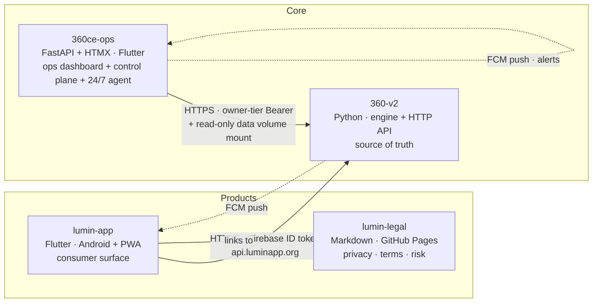
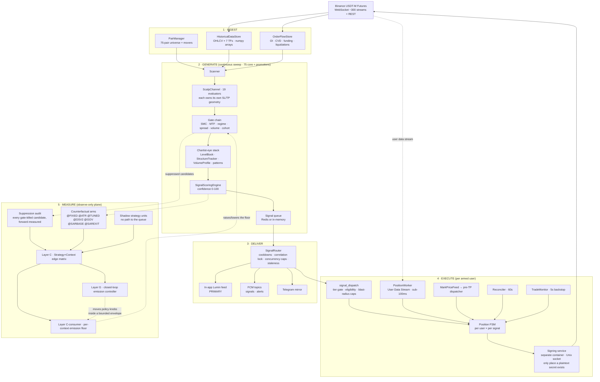
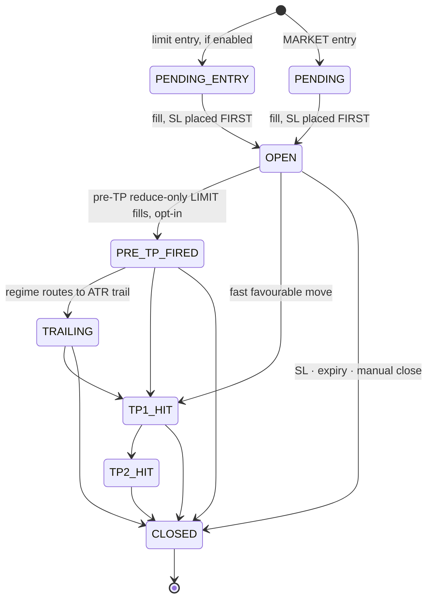

# ARCHITECTURE — the whole system on one map

**Purpose: after ~10 minutes here, a session knows where every piece lives, what
talks to what, and which rules constrain a change — without reading 6,000 lines of
history.**

**The standing rule that keeps it that way: if a session has to go read the code to
answer a question about the *shape* of the system — how many pairs, how many paths,
what writes this file, which flag gates that — the answer belongs in here, and putting
it here is part of that session's work.** Answering "how many pairs and how many
paths" once cost ~40 searches across four repos; §9 now answers it in one lookup and
§10 gives the command to re-check it in one line. Every such question is a one-time
cost that should never be paid twice.

This is the **map**, not the doctrine and not the news:

| Document | Answers | Size |
|---|---|---|
| **`ARCHITECTURE.md`** (this file) | *What is the system, and where does anything live?* | stable — changes only when a subsystem is added or rewired |
| `OWNER_BRIEF.md` | *What are the rules, and why?* — roles, business rules B1–B18, doctrine | stable — owner-sign-off territory |
| `ACTIVE_CONTEXT.md` | *What happened lately, and what's open?* | append-only, one entry per session |
| `CLAUDE.md` (×4 repos) | *How do I work here?* — protocol, hard limits, conventions, hard-won lessons | per-repo |

**Session-start order:** `auto-detected` GitHub Issues → this file (skim §0–§2, jump to the
subsystem you're touching) → `OWNER_BRIEF.md` → `ACTIVE_CONTEXT.md` (top entry is enough
unless you're resuming a thread).

**One canonical copy.** This file lives in `360-v2` and is pointed at from the other
three repos. It is deliberately *not* mirrored — a drifting mirror is worse than a
pointer (see `CLAUDE.md`, Layer-G lesson: *"the fix for a drifting mirror is not a
second mirror"*).

---

## §0 — The 60-second version

We run a 24/7 crypto-futures scalping signal engine and the products around it.

1. **Ingest** — Binance WebSocket + REST feed a candle/order-flow store for the top **75**
   USDT-M futures pairs across **7 timeframes**, out of a full futures universe of ~600.
2. **Generate** — a scanner sweeps continuously (back-to-back cycles, 1s pause), runs
   **19 evaluators (17 live)** per eligible pair, pushes survivors through a gate chain,
   and scores them 0–100. Exact counts and where they're set: **§9**.
3. **Deliver** — A+ (80+) and B (65–79) go to the in-app Lumin feed (primary surface),
   with FCM push and a Telegram mirror. Below 65 is dropped.
4. **Execute** — for subscribers who armed auto-trade, each signal is dispatched
   per-user into a Position FSM that places real Binance orders through an isolated
   signing service.
5. **Measure** — everything that *didn't* emit, plus counterfactual arms on everything
   that did, is forward-measured on real candles into a Strategy×Context edge matrix
   that feeds emission decisions back into step 3.
6. **Control** — the owner reads and steers all of it from `ops.luminapp.org`.

**Money is made** at step 3–4 and **protected** at step 4. **Every claim about
performance** comes from step 5. Confusing those three planes is this system's most
expensive recurring bug — see §3.

---

## §1 — The four repos



| Repo | Owns | Never does |
|---|---|---|
| **`360-v2`** | Signal generation, scoring, execution, entitlement truth, the HTTP API, all engine state | — |
| **`360ce-ops`** | Diagnostics, measurement surfaces, **owner control plane**, 24/7 monitoring agent | Modify engine code; mutate engine state except through owner-gated engine endpoints |
| **`lumin-app`** | Consumer UX, charts, client-side order placement, Play Billing client | Derive money-path truth locally — it renders engine state |
| **`lumin-legal`** | Public legal docs the app and Play Console link to | Assert product behaviour not sourced from `OWNER_BRIEF.md` |

**Brands:** *Lumin* = consumer app. *360 Crypto Eye* = engine / signal source.

**Cross-repo work is normal** — an engine endpoint plus its app UI ships as paired PRs
on a shared branch name. Cross-repo field names are **contracts**: pin them in a test on
the *producing* side, or a rename silently empties a page in another repo (the
`entry_regime` incident, #817).

---

## §2 — The system map



### The two process modes

`API_PROCESS_ISOLATED` in `.env` picks one. **Production runs isolated.**

```
isolated = true  (LIVE on VPS)              isolated = false (local dev)
┌──────────┐  snapshot:*  ┌──────────┐      ┌────────────────────────┐
│  engine  │ ──────────►  │   api    │      │  engine + HTTP in one  │
│  scanner │    Redis     │  HTTP    │      │  process, one loop     │
│  FSM     │ ◄──────────  │  facade  │      └────────────────────────┘
└──────────┘  snapshot:cmd:* └────────┘
      │  shared SQLite volume  │
      └────────────────────────┘
```

- `engine` never serves HTTP; it writes state to Redis via `SnapshotWriter` each cycle.
- `api` serves HTTP on its own event loop and reads Redis through `RedisEngineFacade`.
- Writes that must reach the engine (mode flips, manual take, ledger clears) queue as
  `snapshot:cmd:*` keys and are consumed engine-side.
- Per-user settings go the other way: **API writes SQLite → engine reads a fresh SELECT
  at dispatch** (WAL mode, shared volume). A setting change takes effect on the next
  signal dispatch — no worker cache to invalidate.

---

## §3 — The three planes (read this before changing anything)

Most of the expensive bugs in `ACTIVE_CONTEXT.md` are one plane's code being judged by
another plane's rules. Name the plane you're in before you write a line.

| | **Money path** | **Measurement path** | **Display path** |
|---|---|---|---|
| **What it is** | Anything that changes what emits, what a subscriber sees, or what an order does | Stamping, shadow arms, counterfactuals, forward-resolution, the edge matrix | Ops panels, app cards, truth-report sections, exports |
| **Where** | scanner gates, scoring, router, `signal_dispatch`, FSM, `context_emission_policy`, Layer G | `suppression_audit`, `strategy_edge`, `geometry_ab`, `sar_exit_shadow`, `shadow_strategies` | `360ce-ops/app/routes/*`, `runtime_truth_report`, app UI |
| **Ships** | **Dark-flag-first**: user-visible flag default **OFF**, shadow-measured on a real window, activated only on owner sign-off | **ON the day it ships** — a measurement that ships OFF produces an empty panel and a deferred decision | Normally, via PR |
| **Failure mode** | Real money lost | A verdict that describes nothing — and *looks* full | A true number captioned into a false claim |
| **Non-negotiable** | Blast-radius caps, naked-position invariant, secret handling | Refuse rather than clamp; record a fact where it becomes true; count every fail-open | Measure on the population the page is showing; truncate after filtering |

**Dark ≠ off.** Dark means *invisible to users, fully live to the owner*. Two flags,
never one: measurement **ON**, user-visible effect **OFF**. A dark change that ships
without its ops surface is unfinished.

**Provenance has three states, not two** — and only the router knows the third:

| State | Meaning | Written by |
|---|---|---|
| `suppressed` | a scanner gate killed it | gate chain |
| `enqueued` | passed every scanner gate, `signal_queue.put` accepted it | enqueue site |
| `emitted` | **the router confirmed delivery** | `sar_exit_shadow.promote_to_emitted`, from the router, only |

Stamping `emitted` at enqueue once inflated the only population allowed to justify a
live change by ~30×, non-randomly. `provenance` (display/analysis) and
`strategy_edge.source` (routing) are different fields that share the word "emitted" —
never re-derive one from the other.

---

## §4 — Subsystem detail

### 4.1 Ingest

| Piece | Module | Notes |
|---|---|---|
| Pair universe | `src/pair_manager.py` | Top **75** USDT-M futures by 24h volume + dynamic promotions. **A symbol can rotate out** — anything keyed on the live universe goes blind to what left it (#815) |
| Candle store | `src/historical_data.py` | **7 timeframes**, **numpy arrays** — never boolean-test them (`is None` / `len()`); `update_candle` appends only on `k["x"]`, so the newest bar is the last *closed* one |
| Order flow | `src/order_flow.py` | OI, CVD, funding, liquidations |
| WS transport | `src/bootstrap.py`, `src/main.py` | Multi-connection, heartbeat, auto-reconnect, REST fallback |

**The scanned universe is not fixed** — it is a core set plus two promotion paths:

```
full futures universe  ~600 pairs   ← !ticker@arr sees all of it; only the mover
                                      detector reads at this width
        │
        ├─ core scan set        top 75 by 24h volume   TOP50_FUTURES_COUNT=75
        │                       (TOP50_FUTURES_ONLY=true → all treated Tier 1,
        │                        full scan every cycle; spot excluded entirely)
        ├─ mover promotions     ≤ 30, 6h TTL           MOVER_PROMOTION_MAX_PAIRS=30
        │                       ≥15% 24h move + ≥$5M vol, or an ignition burst
        └─ volume-surge promos  ≤ 5                    SURGE_PROMOTION_MAX_PAIRS=5

  → up to ~110 pairs in a cycle, minus whatever `_prefilter_pairs` drops.
    WS degraded → hard cap at WS_DEGRADED_MAX_PAIRS=75.
```

Stablecoin pairs and TradFi/commodity perps are blacklisted out of the universe
(the latter after a paid user's auto-trade was rejected `-4411`, Session 65).

### 4.2 Generate

`Scanner` (`src/scanner/__init__.py`) — cycles run **back-to-back with a 1s sleep**, so
the effective cadence is the sweep's own duration (~3s since the Session-18 latency fix;
watch `telemetry.scan_latency`). It is **not** a fixed 15s timer, whatever older docs say.

```
per pair → 19 evaluators (src/channels/scalp.py, _evaluate_*)
         → gate chain      smc_hard_gate · trend_hard_gate · mtf_gate ·
                           ranging/countertrend family blocks · min_confidence_pass
         → chartist-eye    LevelBook · StructureTracker · VolumeProfile · chart_patterns
                           (scoring only — never invents a setup; bonuses bounded)
         → SignalScoringEngine  (src/signal_quality.py, src/confidence.py) → 0-100
         → entry_quality   post-scoring gate (src/entry_quality.py) — LIVE, per-rule
                           ops switches, fail-open, every rejection _stamp_suppressed
         → _enqueue_signal (universal SL floor 0.80%)
              ├ structural_snap   level-aware SL/TP1 (measure ON · apply OFF)
              ├ path_retirement   retired (setup, side) → divert, never delete
              ├ dark_emission     dark divert — the row is measured, not delivered
              └ dark_promotion    a matching dark row falls through to the queue
```

**`_enqueue_signal` is the single choke point every path passes through, and four
things decide a candidate's fate there.** Geometry is rewritten up to four times
before it (noise-floor widener, `predictive.adjust_tp_sl`, the min-distance clamp,
that clamp's proportional TP rescale), so *after* the clamp is the only place a
measurement describes the stop the trade actually gets.

`path_retirement` (`src/path_retirement.py`, #928) removes a `(setup_class, side)`
from the live feed by **diverting it to the dark lane rather than dropping it** — a
path deleted outright can never earn its way back, which is `cohort_edge`'s absorbing
state arriving as a routing decision. `dark_promotion` (#923) is the same seam in the
opposite direction, under owner-set per-path conditions.

**Not every path runs on every pair.** Two allowlists compose — both must allow an
evaluator for it to run, and the mover restriction always supersedes:

| Restriction | When | Paths allowed |
|---|---|---|
| *(none)* | Structurally aged pair in the core set | all **17 live** |
| `_YOUNG_PAIR_EVALUATORS` | 1d level count < `MIN_1D_LEVELS_FOR_STRUCTURE_PATHS` — a fresh listing has no aged structure to read | **8**: VSB · BDS · ORB · WHALE · LIQ_REVERSAL · FUNDING · MTP · MAVWAP |
| `_mover_evaluators` | Pair is mover-promoted — an ignition context | **4**: VSB · BDS · MTP · MAVWAP |

`MEAN_REVERT` is deliberately absent from both: a z-score needs a stable 20-bar mean,
and fading an extension is the anti-thesis of a mover promotion.

**Mover promotion is a claim on a map another module owns, and it is now bounded by
behaviour rather than only by a clock.** `mover_ignition` admits a pair on
`|24h change| ≥ MOVER_PROMOTION_MIN_PCT` plus a volume floor; `scanner._ensure_mover_pair`
parks it in `pair_mgr.pairs` under an explicit `hold_symbol` claim.
`mover_retention` (`src/mover_retention.py`, #927) then decides each sweep whether the
pair is still working — HOLD · RELEASE · EXTEND · WARMUP, on candidate flow and burst
ratio, floored at `MIN_HOLD_SEC` and capped at `MAX_HOLD_SEC`, refusing to judge under
`MIN_SCANS_TO_JUDGE`. Two facts ride from the promotion onto every signal it produces:
`promotion_age_sec` (where in the hold we entered) and `promotion_change_pct` (#929) —
**signed**, because the engine admits top gainers and top losers on the same absolute
threshold and stored `abs()`, so nothing downstream could tell a pair up 30% from one
down 30%. `None` there means the detector could not report it, never `0.0`.

- **Every evaluator owns its own SL/TP geometry (B7).** No shared universal formula.
- **`SetupClass`** (`src/signal_quality.py`) is stringly coupled to `_MAX_SL_PCT_BY_SETUP`
  keys and telemetry event names — rename in all three places at once.
- **Score a setup on the evidence that defines it** — a low-volume pullback entry is
  low-volume *by design*; scoring it off the entry candle guarantees it never clears 65.
- Tiers: **A+ 80–100** and **B 65–79** → delivered free, in full. **< 65** → dropped.

### 4.3 Deliver

`SignalRouter` (`src/signal_router.py`) is a second, independent filter layer — it drops
most of what it dequeues: correlation lock, per-symbol and per-channel cooldown,
per-channel concurrency cap, correlation-group limit, global same-direction throttle,
TP/SL sanity, staleness. **Enqueue is not dispatch.**

| Surface | Path | Role |
|---|---|---|
| In-app Lumin feed | `src/signal_history_store.py` → `/api/signals` | **Primary** (B1) — full levels, free |
| FCM push | `src/push_notifications.py`, topics `signals` / `alerts` | Alerting only |
| Telegram | `src/telegram_bot.py` | **Mirror only.** Works in-region; its wider role is a separate owner session |

Control (kill switch, mode flips, manual close) is **ops-only** — it needs the audit
trail. Alerting is read-only, so FCM and Telegram are both fine.

### 4.4 Execute

`signal_dispatch` (`src/execution/signal_dispatch.py`) fans one signal out per armed
user, fresh-reading that user's settings, then drives a **Position FSM per user × per
signal**.



States are pinned in `src/execution/position_state.py`; transitions in
`position_fsm.py`. **Default exit profile is TP1-full against a fixed SL** — pre-TP
banking and invalidation kills survive only as per-user opt-ins (B17).

| Driver | Module | Cadence |
|---|---|---|
| `PositionWorker` | `position_worker.py` | Binance User Data Stream, sub-100ms transitions |
| Mark-price / pre-TP | `mark_price_feed.py`, `pretp_dispatcher.py` | ~1/sec per open symbol — **the hottest loop in the system** |
| `Reconciler` | `reconciler.py` | 60s diff; force-closes anything open past the age cap |
| `TradeMonitor` | `src/trade_monitor.py` | 5s backstop |
| Manual take | `manual_take.py` via `snapshot:cmd:take` | Server-side "take this signal" |
| **Trail governor** | `execution/trail_governor.py` | Monitor sweep — **the only thing here that moves a resting stop order.** Per-user opt-in |

**Order-type doctrine:** entry = MARKET; profit-taking = **reduce-only LIMIT** (maker
fill, zero slippage, survives an engine blip); protection = MARKET reduce-only.

**The trail governor — where ten sessions of measurement became an order.** Every
trailing lane before it (`sar_live_shadow`, `atr_trail_live`) records where a stop
*would* have been parked. `trail_governor` parks it, on a live position, and is gated
twice: engine-wide `TRAIL_GOVERNOR_ENABLED`, and a **per-user** `exit_mechanism`
(`default` | `sar` | `chandelier`) that is itself the user-visible flag — no subscriber
is touched unless their own column says so. Four properties, each bought by a defect:

- **Never-naked is a property of call ORDER, not of retry success.** `_park` places the
  new conditional stop *then* cancels the superseded one. Cancel-first leaves a window
  where a gap costs the position.
- **The second resting order is `reduceOnly` + size, not `closePosition`.** Binance
  refuses a second `closePosition` stop in the same direction (**-4130**), so the
  original design could not hand over on any position from the day it shipped. The
  safety argument is therefore about *acceptance*, not fills — and the evidence for the
  replacement is the running system: the whole TP ladder is already that shape.
- **Refuse, never adopt mid-flight.** `ladder_touched` (pre-TP fired, BE shifted, a TP
  leg filled) is a refusal — the governor only governs geometry still as dispatched.
- **A failure must advance the retry clock.** `trail_last_bar_ms` advanced only on a
  successful park, so the `same_bar` guard never engaged after a rejection and the same
  level went back to the exchange every tick (~24 rejected orders/min, indefinitely).

Fills land through the FSM as `TRAIL_STOP` (`coid_trail`), so a governor exit is
nameable apart from an SL hit in every downstream record. A governed position's stop
can be **wider** than the one it was sized for — SAR's has been up to 21% away — so a
governed loss is risk the trade was never sized for. Read the risk columns before any
PnL. Diag: `/internal/diag/trail-governor` → ops `/signals/trail-governor`.

**Safety envelope — never weakened:** symbol allowlist, per-user rate limit (10/min,
50/hr), per-user position cap, global kill switch, global circuit breaker (>10
rejections/60s), per-user circuit breaker (>3/5min), leverage cap. **Naked-position
invariant:** SL placement failure force-closes at market.

**Key custody:** user keys are KMS-encrypted in Firestore (`firestore_keystore.py`,
cached); the plaintext secret materialises only inside the signing-service process for
one request. Connect-time validation auto-rejects any key with withdraw permission.

### 4.5 Measure — the Autonomous Portfolio (Layers A–G)

Edge lives in `session × regime × strategy` cells, not in a global confidence number.

| Layer | Module | State |
|---|---|---|
| A — market context vector | `src/market_context.py` | LIVE |
| B — strategy registry / affinity | `src/strategy_portfolio.py` | LIVE |
| C — Strategy×Context edge matrix | `src/strategy_edge.py` | LIVE — **everything routes on it** |
| C→consumer — per-context emission floor | `src/context_emission_policy.py` | **LIVE, money path** |
| D — allocator | `src/strategy_allocator.py` | Recommendation-only — **consumed by nothing** |
| G — closed-loop emission controller | `src/emission_controller.py` | **LIVE**, self-tuning in a bounded envelope |

Feeders: `suppression_audit.py` (every gate-killed candidate, forward-measured →
per-gate KEEP/TUNE/DROP), `shadow_strategies.py` (4 units with no path to the queue),
and the counterfactual arms (`geometry_ab.py`, `tuned_variants.py`, `staleness_v2.py`,
`sar_exit_shadow.py`).

**Replay measurement vs live measurement — a distinction added 2026-07-30 (#832).**
Everything above is *replay*: a candidate is stamped, then a resolver walks candles
forward some time later and scores it. That answers "what would this have done,
looking back". It cannot answer whether a mechanism is **operable** — whether the
level can be computed in time, parked, and acted on before the outcome is known —
and a replay's population is only as good as its resolver. On 2026-07-30 the SAR
replay ledger had 8 of 19 rows unresolved, *including all four of the window's
winners*, so its verdict was an artefact of which symbols the refresh budget reached.

`src/sar_live_shadow.py` is the first arm of the second kind. It runs inside
`TradeMonitor`'s poll, stepping each open signal's arms bar by bar, so a row carries
the stop the mechanism **would have parked right now**. Nothing is deferred, so
nothing can be starved.

| | Replay arms | `sar_live_shadow` |
|---|---|---|
| When scored | minutes to 48h later, by a resolver | forward, in the monitor loop |
| Candle source | resolver refresh (budget-capped) | in-memory store, already warm |
| Failure mode | rows never resolve; population silently loss-selects | arm cannot step → counted + paged |
| Answers | "would this have been profitable" | "…and could we actually have done it" |

**The live SAR arm's shape** (owner-specified): SAR onside at generation governs from
bar one and the original SL/TP1 are never used; SAR opposed keeps them live until SAR
comes onside, then cancels them and hands over; TP1 closes in full if it lands first.
Measured on **5m and 15m as independent arms** per signal. Two fills are recorded —
the parked stop touched intrabar, and the flip confirmed at the bar close and exited
at market — because *"close at market on the flip"* implies no resting stop between
bars, which would breach the naked-position invariant (§7) the moment it went live.
The gap between the two fills is the cost of confirmation, and it is the number an
adoption decision needs. Ops surface: `/signals/sar-live`.

**Four standing cautions:**
1. **Measurement arms are not strategies.** `@FIXED @ATR @TUNED @DSV2 @GOV @SARBASE
   @SAREXIT` are stamped from the *same candidates* as real rows. Authoritative list:
   `geometry_ab._VARIANT_SUFFIXES`; ops mirrors it in `strategy_lab.MEASUREMENT_SUFFIXES`
   — keep them in sync. **Any code keyed off the matrix inherits the arms** — before
   writing matrix-derived state, ask *"who reads this key, and are they keyed the same
   way?"*
2. **Counterfactuals are optimistic** (~0.38R measured). Never quote one as an expected
   live result. All R is **cost-aware** since W1/W2 (`src/trade_costs.py`).
3. **Zero emissions ≠ broken.** Fully gated + measured-negative is the gates working;
   fully gated + measured-*positive* is money on the table. `gated_path_verdict`
   distinguishes them.
4. **Wait for a fresh window** after any scoring or cost change — rolling per-cell
   windows keep serving pre-change data.

### 4.6 Control and observation — `360ce-ops`

| Surface | Route | Reads |
|---|---|---|
| Pulse / positions / signals | `/pulse` `/positions` `/signals` | Engine REST |
| Strategy Lab | `/strategy-lab` `/raw-edge` `/emission-controller` | Edge matrix + gate audit |
| Dark measurement | `/dark-signals` `/sar-exit` | Shadow ledgers |
| Recorded outcomes | `/track-record` `/performance` | `signal_performance.json` |
| Reconstructed what-ifs | `/profit` `/exit-backtest` | Candle replay |
| Diagnostics | `/diag/*` `/data` `/truth` `/invalidations` | Data volume · monitor-logs · `docker exec` diag scripts |
| System X-ray | `/system` `/system/liveness` `/system/redis` | Docker state · engine loop counters · CPU vs **quota** |
| **Diag console** | `/diagnostics/console` | Engine diagnostic **catalog** — named reads + reversible actions |
| **Control plane** | `/control/*` | Owner-gated engine endpoints |
| Alerts | `/alerts` | Monitoring agent's Redis state |

**Control doctrine:** owner-gated end to end · every action audited (best-effort, never
blocking) · POST→redirect→GET with explicit confirm on destructive actions · **the
engine is the source of truth** — ops reads state back after every write, never holds it.

**Recorded vs reconstructed is a hard line.** `/track-record` is recorded reality only.
A reconstructed number wearing a track record's name is the most dangerous artefact this
system could produce — it is what a subscription decision would rest on.

**The diagnostic catalog** (`360-v2/src/diag_catalog.py`, added 2026-08-19) is how a
surface drives the engine **without a shell**. Ops posts a catalog *key*; the engine
decides what that key may do. Two kinds — `read` observes, `action` mutates something
reversible and off the money path (flush a ledger, drop a rebuildable cache, re-seed one
symbol). **No entry can reach an order, a key, the kill switch, auto-execution mode, the
FSM or per-user settings**, and that is asserted per entry by walking its syntax tree,
not promised in prose. Actions are separately switchable engine-side
(`DIAG_ACTIONS_ENABLED`), enforced where entries *run* rather than where they render.

It crosses into the **engine** container over a Redis request/response queue (the
manual-take shape: LIST in, result under a request id) because in isolated mode the API
process cannot see the scanner, the stores or the executor — a diagnostic assembled
there would describe the wrong process. The drain is bounded per cycle so it cannot
starve the snapshot writes; a stale envelope is refused rather than applied.

**The read-only tier** (`/guest`) is the second door: a short-lived owner-minted code,
revoked per request rather than at login. Its scope is `GET`/`HEAD` **plus exactly one
allow-listed POST** — the diag console — narrowed from an absolute ban on 2026-08-19
because a pure-read tier cannot diagnose. The allow-list is bounded at one entry by test,
each entry carries a written reason, and every other write route stays refused.
`docs/READ_ONLY_ACCESS.md` in that repo is the full argument.

**24/7 agent** (`app/agent/`, own container, 60s cycle): Tier-0 detectors — naked
position, signing service down, engine/Redis stale, fire-rate anomalies, FSM
distribution, deploy health. Redis-backed dedup/escalation FSM; pages via FCM; files
GitHub Issues tagged `auto-detected` (**read these at session start**); heartbeats to
healthchecks.io.

### 4.7 The consumer app — `lumin-app`

Flutter, Android (Play production) + installable PWA. Compile-time channel via
`lib/app/distribution.dart` — `play` builds have the self-updater inert.

```
main.dart → Firebase.init → NotificationService → AppConfig.load
  → WelcomePage → WelcomeConsentPage (18+ · risk · not-advice)
  → Firebase phone-OTP AuthGate → NavShell
       Pulse · Signals · Charts · Trade · Menu
```

- **`LuminRepository` (`lib/data/repository.dart`) is the single seam** between UI and
  data — `MockRepository` vs `HttpRepository` chosen at startup. Pages never do HTTP.
  New data behaviour = a new method on **both** implementations.
- **Two Binance execution paths, never conflated:** *client-side* (`binance_client.dart`,
  device signs, keys in `flutter_secure_storage`, engine never sees them) and
  *server-side* (`POST /api/auto-trade/take`, engine dispatches on a KMS-held key).
- **Entitlement is server-side truth.** Play `purchaseToken` → `POST /api/billing/play/verify`
  → engine sets tier. Client-side gating is UX only.
- **Charts** are `webview_flutter` + vendored TradingView Lightweight Charts, fed
  straight from Binance public REST — no key, no engine load.
- **Render engine state; never derive it.** A card showing "armed" while dispatch
  silently skips is a bug class this repo has already paid for.

---

## §5 — State map — where every fact lives

| Store | Holds | Lifetime | Notes |
|---|---|---|---|
| **Redis** `snapshot:*` | `engine_state` `signals_all` `positions_diag` `activity_all` `alerts` `agents_all` `tickers` | seconds | Engine→API bridge in isolated mode |
| **Redis** `snapshot:cmd:*` | `set_mode` `take` `reset_signals` `clear_sar_ledger` | one-shot | API→engine command queue |
| **Redis** (ops) | `alert:state:{fingerprint}` | escalation window | Agent dedup FSM; in-memory fallback |
| **SQLite** (shared volume) | `users` `user_auto_trade_settings` `user_pretp_settings` `user_invalidation_settings` `user_symbol_management` `paper_trades` `user_paper_subscriptions` `play_purchases` `user_trials` `user_referral_codes` `user_referral_redemptions` `user_reward_grants` `referral_commissions` | durable | API writes, engine reads fresh at dispatch (WAL) |
| **Firestore** | KMS-encrypted Binance keys, per-user position state | durable | **Reads dominate the cloud bill** — every hot-path reader must be cached and invalidation-gated |
| **Cloud KMS (HSM)** | Master key | durable | Engine holds Decrypt IAM only |
| **`data/*.json`** (volume, mounted read-only into ops) | `signal_performance.json` `signal_history.json` `invalidation_records.json` `strategy_edge_store.json` `suppressed_candidates.json` `emission_controller_store.json` `market_context.json` `feature_liveness.json` `dispatch_log.json` `pnl_history.json` `alerts.json` `level_book.json` `circuit_breaker_status.json` `sar_live_arms_v1.json` … | durable | The measurement plane's substrate |
| **`monitor-logs` branch** | Truth report, runtime audit artifacts | per CI run | `git show origin/monitor-logs:monitor/report/truth_report.md` |

**Cost rule, learned at ₹4,552/month:** a single uncached Firestore query on the
mark-price tick was 99.9% of the GCP bill. **Never add an uncached read or write to a
per-tick, per-scan, or per-order loop.** Cache it and gate the cache on an explicit
invalidation signal (`position_state.get_write_generation()`), with a defensive TTL
bound. Firestore bills under the **"App Engine"** line — an App Engine charge with no
App Engine service deployed is Firestore.

---

## §6 — Deployment topology

```
VPS (Ubuntu · Docker Compose · 24/7)          Cloudflare
┌────────────────────────────────────┐        api.luminapp.org  → engine api
│ 360scalp-v2-engine     scanner·FSM │        ops.luminapp.org  → ops web
│ 360scalp-v2-api        HTTP        │
│ 360scalp-v2-redis      bridge      │        GitHub Pages
│ 360scalp-v2-signing    Unix socket │        mkmk749278.github.io/lumin-legal
│ 360scalp-v2-autoheal   restarts    │
│ 360scalp-v2-watchdog   liveness    │        Google Play
│ ops web · ops agent · ops redis    │        org.luminapp.lumin  (AAB from CI)
└────────────────────────────────────┘
```

| Repo | Push to `main` → |
|---|---|
| `360-v2` | GitHub Actions → `bash deploy.sh` on VPS, **~45s to live**. Doc-only paths are `paths-ignore`'d |
| `360ce-ops` | Auto-deploy, ~60s |
| `lumin-app` | Full CI build → auto-created GitHub Release (sideload APK + Play AAB) |
| `lumin-legal` | GitHub Pages deploy |

**A `main` merge reaches real users.** That is the whole reason for the dark-first rule
in §3. Android platform scaffolding is **not checked in** — CI regenerates `android/`
with `flutter create` and patches it; native config changes are edits to the workflow's
patch steps.

### The infrastructure outside the code

The parts of this system that no repo contains, and that a session cannot discover by
reading source. Procedures live in `docs/DR_RUNBOOK.md`; this is the map.

| Layer | Fact |
|---|---|
| **Host** | Single Ubuntu VPS at **`194.163.141.135`**, Docker Compose, 24/7. 4 cores — the engine container was capped at 1.5 of them until Session 85. This address is load-bearing: see the whitelist hazard below |
| **Domain** | `luminapp.org` — **registered at Namecheap**, nameservers delegated to **Cloudflare**; all DNS records are managed in Cloudflare, not at the registrar. Change records in Cloudflare; touch Namecheap only for renewal and nameserver changes |
| **DNS records** | Three records, one box, **two different routing modes** — verified 2026-07-29: `api.luminapp.org` → Cloudflare (proxied) · `ops.luminapp.org` → Cloudflare (proxied) · **`app.luminapp.org` → `194.163.141.135` directly (DNS-only)** |
| **TLS / edge** | Cloudflare terminates TLS for `api` and `ops` (`server: cloudflare`, `cf-ray` present). **`app` is served by the VPS's own `nginx/1.24.0` with its own certificate** — no Cloudflare in the path at all |
| **Backup layers** | Nightly encrypted data-volume backup **only**. No provider-level VPS snapshots, so DR is always a rebuild-from-scratch: the runbook's ≤2h RTO has no shortcut behind it, which is exactly why the quarterly restore drill is not optional |
| **Deploy path** | GitHub Actions SSHes in using `VPS_HOST` / `VPS_USER` / `VPS_SSH_KEY` repo secrets. There is no manual deploy step in the normal flow |
| **Scheduled workflows** | `deploy.yml` (on `main`) · `vps-backup.yml` (nightly 21:45 UTC) · `vps-liveness.yml` · `vps-monitor.yml` (truth report → `monitor-logs`) · `ci.yml` |
| **Secrets** | 26 GitHub Actions secrets across the repos — VPS SSH, Binance, Telegram, Firebase/FCM, Android signing keystore, NOWPayments, backup passphrase, GHCR/PAT. **`.env` exists only on the VPS and in the owner's password manager — never in a repo, by design.** The continuity pack (`docs/CONTINUITY_PACK_TEMPLATE.md`) must hold a current copy or DR fails at step 4 |
| **Backups** | Nightly encrypted snapshot of the data volume: 14 local rotations + a 30-day GitHub artifact. **RPO ≤ 24h, RTO ≤ 2h.** A failed backup files a `severity:high` `auto-detected` issue |
| **Google Cloud** | Firestore (key blobs, position state, kill switch) · Cloud KMS HSM (master key; engine holds Decrypt only) · Firebase Auth · FCM. Firestore bills under the "App Engine" line |
| **Store / distribution** | Google Play — `org.luminapp.lumin`, production track. GitHub Releases for the sideload APK. GitHub Pages for `lumin-legal` |

**⚠️ The VPS IP is load-bearing, and changing it is a user-visible outage.** Every paid
auto-trade user has IP-whitelisted **this exact address** on their own Binance API key
(B18, connect-time validation). A new IP — new box, provider migration, or a second IP
added to the same box — silently breaks every one of those keys until each user edits
their whitelist themselves. It is not an infrastructure decision; it is a migration
with a user-comms plan. `docs/UNIVERSE_EXPANSION_AND_SECOND_IP_2026_07_27.md` §6 calls
this the whitelist landmine, and `docs/DR_RUNBOOK.md` Scenario A sequences the DNS
cutover around it.

### The edge configuration is mixed, and that has consequences

Measured 2026-07-29 from outside the network:

```
api.luminapp.org  → 104.21.24.34, 172.67.216.188   server: cloudflare   cf-ray ✓   PROXIED
ops.luminapp.org  → 104.21.24.34, 172.67.216.188   server: cloudflare   cf-ray ✓   PROXIED
app.luminapp.org  → 194.163.141.135                Server: nginx/1.24.0            DNS-ONLY
```

Three facts follow, and none of them are obvious from the Cloudflare dashboard's
per-record view:

1. **The origin address is public.** One `dig app.luminapp.org` returns
   `194.163.141.135`. Whatever concealment proxying `api` and `ops` was meant to
   provide is already void — the PWA record publishes the same box. *(This is also
   why recording the IP in this file costs nothing: it was never private.)*
2. **The PWA gets no edge.** `app.luminapp.org` is a real user surface — the iPhone
   channel — served straight off the VPS with no Cloudflare DDoS absorption, no WAF,
   and no edge caching. Its TLS is the box's own nginx certificate, which makes
   **certificate renewal on the VPS load-bearing for a user-facing surface**: an
   expired cert there is a hard browser-level failure for every PWA user, and nothing
   in the monitoring agent's Tier-0 detectors watches for it.
3. **Proxying `api`/`ops` only buys protection if the origin refuses direct
   connections** — which is the open item below. With the address public, an
   attacker who can reach the origin on 443 bypasses the edge by sending the right
   `Host` header. Whether that works is untested; it depends entirely on the firewall.

**Open item — the origin firewall.** `deploy_vps.sh` configures **no** firewall: no
`ufw`, no `iptables`. Unless one was added by hand, the origin accepts 443 from
anywhere, and fact 3 above is live rather than theoretical. Settle it with
`sudo ufw status` on the box.

The fix is **not** simply locking 443 to [Cloudflare's ranges](https://www.cloudflare.com/ips/)
— that would take `app.luminapp.org` offline instantly, because the PWA is DNS-only and
its traffic does not come from Cloudflare. Any origin lockdown has to either proxy the
`app` record first, or scope the restriction per-`server_name` in nginx rather than at
the packet filter. **Confirm which before touching the firewall** — the safe-looking
step is the one that breaks a live user surface.

---

## §7 — Invariants that constrain every design

Violating one of these is never a trade-off to be weighed; it's a blocked design.

| # | Invariant |
|---|---|
| 1 | A position never sits OPEN without a stop |
| 2 | A Binance secret is never logged, never written to disk, never surfaced in an error |
| 3 | A key with withdraw permission is auto-rejected — no override |
| 4 | Blast-radius caps are never disabled or weakened |
| 5 | Nothing is pushed to `main` directly; every change ships via PR |
| 6 | Performance numbers are never fabricated, and a reconstructed number never wears a recorded label |
| 7 | No uncached read/write on a hot path |
| 8 | No silently swallowed exception in a data/measurement path — every fail-open calls `fail_open.record` |
| 9 | Candle/series arrays are never boolean-tested |
| 10 | A money-path change ships dark, shadow-measured, owner-signed-off — with its ops surface |
| 11 | Every new measurement pipeline registers a liveness probe |
| 12 | Refuse, don't clamp — an input that can't support the computation returns None/INSUFFICIENT |
| 13 | The engine's public IP does not change without a user-comms plan — every paid user's Binance key is whitelisted to it (§6) |
| 14 | Nothing reachable from a non-owner surface can touch an order, a key, the kill switch, auto-execution mode, the FSM or per-user settings. The diagnostic catalog is the only such surface, and its compliance is asserted per entry by AST rather than promised (§4.6) |

**Owner sign-off required** (never auto-merge): signing service / KMS / connect-time
validation / blast-radius caps · Position FSM transitions · new evaluator paths or
scoring models · Business Rules · paid-channel routing · regime-per-exit design ·
substantive legal-content changes.

---

## §8 — Where do I look when…

| Symptom | First stop |
|---|---|
| "No signals firing" | Suppression telemetry — every gate rejection is tagged. Then `gated_path_verdict` before assuming a fault |
| A number on an ops page looks wrong | Which plane (§3)? Then: is it measured on the population the page shows? Was it truncated before filtering? |
| A panel is full but meaningless | A field one repo reads and no repo writes — check the producing side (#817) |
| A verdict flipped sign | Unit of evidence — are overlapping entries into one move counted as independent rows? (#816) |
| Auto-trade "armed" but nothing happens | `signal_dispatch` gates: tier gate, eligibility, caps, circuit breakers. The dispatch log, not the UI |
| A Binance-API symptom | **Vendor changelog first** — `developers.binance.com/docs/derivatives/change-log`. Six PRs were once spent instrumenting a decommissioned endpoint |
| Cloud bill spiked | Billing → group by SKU, then Firestore → Usage. Not auth |
| A feature silently flat-lined | `feature_liveness.py` probes + `fail_open` counters |
| Engine state vs app disagreement | The engine is the source of truth; check what the app derived locally |
| Something rotated out of the universe | Any watchdog keyed on the live universe is blind to it by construction (#815) |
| "Would exit method X work?" | Is the arm a replay or live (§4.5)? A replay answers profitability; only a live arm answers operability, and only its population cannot be starved |
| `/signals/sar-live` reads FROZEN or UNAVAILABLE | The engine is not writing `sar_live_arms_v1.json` — `SAR_LIVE_SHADOW_ENABLED` and the monitor loop, not the page. A live price feed is not evidence the measurement is running |

| The engine restarts and the dashboard empties | Scan-cycle wall-time → heartbeat staleness → `healthcheck.py` → **autoheal manual restart** → every `snapshot:*` key past TTL. Docker's `RestartCount` is blind to it (autoheal is not the restart policy); read **uptime against stack-mates** on `/system` |
| "Is the VPS big enough?" | `/system` — CPU against the **quota**, not the host. The same core count is a pinned process or a busy machine depending on it, and only the quota tells them apart |
| "Where did a slow scan cycle go?" | `/system/liveness` stage breakdown, or `read.loop` on the diag console. The sums exceed the cycle by design (concurrent workers) — the **ratio** locates the cost |
| I need engine internals no page shows | `/diagnostics/console` — named catalog, no shell. If the read does not exist, add an entry to `src/diag_catalog.py`; the guards cover it automatically |

**Diagnosis order is always: real data → vendor docs → external verification → code.**

---

## §9 — Inventory: every number, and where it is set

Counted from the code on 2026-07-29, not from prose. Each row names the constant or
symbol that decides it — re-count there rather than trusting this table blind.

### Pairs

| Quantity | Count | Set by |
|---|---|---|
| Full Binance USDT-M futures universe | ~600 | Exchange. Only the `!ticker@arr` mover detector reads at this width |
| **Core scan set — scanned every cycle** | **75** | `TOP50_FUTURES_COUNT` (name is legacy; the value is 75), gated by `TOP50_FUTURES_ONLY=true` |
| Mover promotions (concurrent, 6h TTL) | ≤ 30 | `MOVER_PROMOTION_MAX_PAIRS`, `MOVER_PROMOTION_TTL_SEC=21600` |
| Volume-surge promotions | ≤ 5 | `SURGE_PROMOTION_MAX_PAIRS` |
| **Effective ceiling per cycle** | **~110** | Sum of the above, less `_prefilter_pairs` |
| WS-degraded emergency cap | 75 | `WS_DEGRADED_MAX_PAIRS` |
| REST pair-list fetch depth | 150 | `TOP_PAIRS_COUNT` |
| Legacy three-tier scheme (Tier1/Tier2) | 75 / 200 | `TIER1_PAIR_COUNT`, `TIER2_PAIR_COUNT` — **inactive** while `TOP50_FUTURES_ONLY=true` |
| Timeframes seeded per pair | **7** | `SEED_TIMEFRAMES` — 1m, 5m, 15m, 1h, 4h, 1d (500 candles each) + 1w (200) |

### Paths

"Path" means three different things depending on who's asking — all three are below.

| Quantity | Count | Set by |
|---|---|---|
| **Evaluators in `ScalpChannel`** | **19** | `_evaluate_*` methods, registered in the `evaluate()` dispatch tuple |
| **— live** | **17** | |
| **— disabled** | **2** | `OPENING_RANGE_BREAKOUT` (`SCALP_ORB_ENABLED=false`, pending rebuild) · `CONTINUATION_LIQUIDITY_SWEEP` (2026-05-17, absorbed into LSR's HTF-POI catchment; revert with `CLS_DISABLED_2026_05_17=false`) |
| Portfolio roles — **core / support / specialist** | **7 / 8 / 4** | `ACTIVE_PATH_PORTFOLIO_ROLES` (19 entries, one per evaluator) |
| Paths reaching a **young** pair | 8 | `_YOUNG_PAIR_EVALUATORS` |
| Paths reaching a **mover-promoted** pair | 4 | `_mover_evaluators` |
| `SetupClass` enum members | **29** | `src/signal_quality.py` — 19 live-evaluator identities + 4 auxiliary-channel identities + 6 legacy/unrouted values |
| **Channels** | **8** | `ALL_CHANNELS` — `360_SCALP` + 7 auxiliary |
| — enabled by default | **2** | `360_SCALP` and `360_SCALP_DIVERGENCE` (limited-live). FVG · ORDERBLOCK · CVD · VWAP · SUPERTREND · ICHIMOKU are off; 3 of them keep a radar/discovery role |
| Shadow strategy units (no path to the queue) | **4** | `shadow_strategies.py` — range-fade · mean-revert · funding-fade · cascade-reversal |
| Counterfactual measurement arms | **7** | `geometry_ab._VARIANT_SUFFIXES` — `@FIXED @ATR @TUNED @DSV2 @GOV @SARBASE @SAREXIT` |

**So: 17 live signal-producing paths**, measured in the edge matrix alongside 4 shadow
units and 7 counterfactual arms. The arms are stamped from the *same* candidates as the
real rows — never roll them up as strategies.

### Every path, in dispatch order

`Y` = runs on a young/unaged pair · `M` = runs on a mover-promoted pair. Both blank
means the path needs an aged multi-TF level foundation and only sees core pairs.

| # | SetupClass | Evaluator (`ScalpChannel.`) | Role | Y | M | State |
|---|---|---|---|:-:|:-:|---|
| 1 | LIQUIDITY_SWEEP_REVERSAL | `_evaluate_standard` | core | | | live |
| 2 | TREND_PULLBACK_EMA | `_evaluate_trend_pullback` | core | | | live |
| 3 | LIQUIDATION_REVERSAL | `_evaluate_liquidation_reversal` | support | Y | | live |
| 4 | WHALE_MOMENTUM | `_evaluate_whale_momentum` | specialist | Y | | live |
| 5 | VOLUME_SURGE_BREAKOUT | `_evaluate_volume_surge_breakout` | core | Y | M | **retired from the live feed** 2026-08-13 (#928) — still evaluated, diverted to the dark lane. 0 winners in 11 delivered trades across 11 symbols |
| 6 | BREAKDOWN_SHORT | `_evaluate_breakdown_short` | core | Y | M | live |
| 7 | MOVER_TREND_PULLBACK | `_evaluate_mover_trend_pullback` | support | Y | M | live **LONG only** — SHORT retired 2026-08-13 (#928), diverted to the dark lane. Still ~59% of the enqueued book |
| 8 | MOVER_AVWAP_SCALP | `_evaluate_mover_avwap_scalp` | support | Y | M | live |
| 9 | OPENING_RANGE_BREAKOUT | `_evaluate_opening_range_breakout` | support | Y | | **disabled** — `SCALP_ORB_ENABLED=false`, pending a true-session-open rebuild |
| 10 | SR_FLIP_RETEST | `_evaluate_sr_flip_retest` | core | | | live — shorts only by default (`SR_FLIP_LONG_ENABLED=false`) |
| 11 | FUNDING_EXTREME_SIGNAL | `_evaluate_funding_extreme` | specialist | Y | | live |
| 12 | QUIET_COMPRESSION_BREAK | `_evaluate_quiet_compression_break` | specialist | | | live |
| 13 | DIVERGENCE_CONTINUATION | `_evaluate_divergence_continuation` | support | | | live |
| 14 | CONTINUATION_LIQUIDITY_SWEEP | `_evaluate_continuation_liquidity_sweep` | core | | | **disabled** 2026-05-17 — absorbed into LSR's HTF-POI catchment; `CLS_DISABLED_2026_05_17=false` reverts |
| 15 | POST_DISPLACEMENT_CONTINUATION | `_evaluate_post_displacement_continuation` | core | | | live |
| 16 | FAILED_AUCTION_RECLAIM | `_evaluate_failed_auction_reclaim` | support | | | live |
| 17 | MA_CROSS_TREND_SHIFT | `_evaluate_ma_cross_trend_shift` | specialist | | | live — 24h per-pair cooldown |
| 18 | MEAN_REVERT | `_evaluate_mean_revert` | support | | | live — graduated from `SHADOW_MEAN_REVERT`; shadow unit still runs as the ungated control |
| 19 | RANGE_FADE | `_evaluate_range_fade` | support | | | live — **context-gated**: emits only in cells the edge matrix measures positive |

`setup_class` is assigned as a **string literal** in each evaluator, not the enum — which
is exactly why the rename rule (`SetupClass` ↔ `_MAX_SL_PCT_BY_SETUP` ↔ telemetry names)
has to be applied by hand in all three places.

> The README's "9 scalp strategies / top-50 pairs / single Telegram channel" describes
> the 2.0 engine and is stale on every count. This section is the live inventory.

### Everything else

| Quantity | Count | Where |
|---|---|---|
| Repos | 4 | §1 |
| Containers in production | 8 | engine · api · redis · signing · autoheal · watchdog + ops web · ops agent (ops redis makes 9 with its own) |
| Confidence tiers | 3 | A+ 80–100 · B 65–79 · FILTERED < 65 |
| Position FSM states | **8** | `PositionState` — PENDING_ENTRY · PENDING · OPEN · PRE_TP_FIRED · TP1_HIT · TP2_HIT · TRAILING · CLOSED |
| Execution profiles | 4 | D (TP1-full, **default**) · A · B · C — B17 |
| Portfolio layers | 7 | A · B · C · C-consumer · D · G (D recommendation-only) |
| Engine API endpoints | ~70 | `src/api/` — ~43 consumed by the app, rest ops/admin/webhooks |
| Ops dashboard routes | ~60 | `360ce-ops/app/routes/` |
| SQLite tables | 13 | §5 |
| Redis snapshot keys | 7 state + 4 command | §5 |
| Business rules | 18 | `OWNER_BRIEF.md` Part IV (B5 retired) |
| Engine Python modules | 224 | `src/**/*.py` |
| Env-overridable settings | **587** | `config/__init__.py` — every value, per B8 |
| `*_ENABLED` feature flags | 68 | `config/__init__.py` |
| Feature-liveness probes | **23** | `main._build_feature_liveness` |

### Flags whose default surprises people

Most `*_ENABLED` flags are ON. These are the ones where the default is the opposite of
what the name suggests, or where the default *is* the doctrine:

| Flag | Default | Why |
|---|---|---|
| `PRE_TP_ENABLED` | **false** | Session-34 default flip — TP1-full is the exit; pre-TP is a per-user opt-in (B17) |
| `SIGNAL_EXPIRY_ENABLED` | **false** | |
| `FSM_LIMIT_ENTRY_ENABLED` | **false** | Entry is MARKET; `PENDING_ENTRY` only exists when this is on |
| `SR_FLIP_LONG_ENABLED` | **false** | SR_FLIP is shorts-only until the long thesis re-earns its place |
| `SAR_EXIT_SHADOW_ENABLED` | **false** in code | Owner-enabled in the live env. **This is the flag that taught us measurements must ship ON** — see §3 |
| `WEB_BILLING_*` | **false** | Crypto/Stripe/Razorpay rails built, not switched on |
| `SIGNUP_TRIAL_ENABLED` | **false** | |
| `AUTO_TRADE_TIER_GATE_ENABLED` | **true** | Fail-closed: hands-off execution runs only for `auto` tier (B16) |
| `ALLOCATOR_RECOMMEND_ENABLED` | **true** | Layer D recommends; nothing consumes it |
| `CHANNEL_SCALP_DIVERGENCE_ENABLED` | **true** | The one auxiliary channel in limited-live |
| `PATH_RETIREMENT_ENABLED` | **true** | Reads `RETIRED_PATHS`, which **ships non-empty** — so the default configuration removes two paths from the live feed. A flag whose name suggests a mechanism and whose default carries a *policy* |
| `RETIRED_PATHS` | `MOVER_TREND_PULLBACK:SHORT,VOLUME_SURGE_BREAKOUT:*` | The policy itself, as data. `*` = both sides. **Empty retires nothing** and is a real value, not "unset" — the two are distinguished deliberately |
| `DARK_PROMOTION_ENABLED` | **false** | Engine-wide master for dark→live promotion (#923); each per-path rule carries its own switch, and an armed rule with an empty allow-list matches **nothing** rather than everything |
| `DIAG_ACTIONS_ENABLED` | **true** | The *action* half of the diagnostic catalog. Reads are never gated (they mutate nothing). Enforced where entries **run**, not where they render, so switching it off actually refuses a request rather than hiding a button — and it closes the write half without revoking a guest code |
| `INDICATOR_CACHE_CONTENT_KEY` | **true** | Kill switch for the content-addressed indicator cache key. Off = the old bar-COUNT key, which stops changing at the 1,000-bar bucket cap and serves frozen indicators forever |
| `SCAN_CYCLE_WARN_SEC` / `SCAN_CYCLE_KILL_SEC` | 60 / 120 | Not thresholds ops invented — `healthcheck.py` owns the kill number and every surface grades against these |

### The 23 liveness probes

A feature whose output can silently flat-line without paging is unfinished — this is the
list that enforces it (`RateProbe` = throughput, `PredicateProbe` = health assertion):

```
auto_dispatch · btc_reference · candle_coverage · context_emission_policy
edge_reconciliation · emission_controller · emission_controller_routability
gate_override_shadow · geometry_ab · market_context · mean_revert_emission
mean_revert_path · range_fade_emission · range_fade_path · sar_alignment_crosscheck
sar_exit_shadow · sar_ledger_candles · shadow_units · stale_tf_scoring
staleness_v2_shadow · strategy_edge · suppression_audit · tuned_variants
```

Never signal "idle" or "disabled" by raising inside a `PredicateProbe` — that converts to
a `fail_open.record` and buries real failures in noise. `return True, "…"` instead.

### Who writes each data file, and who reads it

The measurement plane's substrate. Ops mounts `data/` **read-only** at `/engine-data`.

| File | Written by | Read by (ops) |
|---|---|---|
| `signal_performance.json` | `performance_tracker.py` | `/track-record` · `/performance` · agent detectors |
| `signal_history.json` | `signal_history_store.py` | app feed via `/api/signals` · agent detectors |
| `invalidation_records.json` | `invalidation_audit.py` | `/invalidations` · signal detail |
| `strategy_edge_store.json` | `strategy_edge.py` | `/strategy-lab` · `/raw-edge` |
| `suppressed_candidates.json` | `suppression_audit.py` | `/strategy-lab` gate audit · truth report |
| `emission_controller_store.json` | `emission_controller_store.py` | `/emission-controller` |
| `market_context.json` | `main.py` · `strategy_portfolio.py` | Strategy Lab context tables |
| `feature_liveness.json` | `feature_liveness.py` | `/pulse` |
| `dispatch_log.json` | `signal_router.py` · `main.py` | monitor-logs surfaces |
| `geometry_ab_candidates.json` | `geometry_ab.py` | via edge matrix |
| `cohort_edge_store.json` | `stat_filter.py` | cohort gate |
| `level_book.json` · `alerts.json` · `pnl_history.json` · `confidence_log.json` | their own modules | engine-internal |

---

## §10 — Re-derive any of this in one command

**Numbers rot; commands don't.** Every count in §9 came from one of these. Run the
command rather than trusting the number — and if it disagrees, fix §9 in that PR.

```bash
# ── Pairs ────────────────────────────────────────────────────────────────────
grep -nE 'TOP50_FUTURES_COUNT|TOP50_FUTURES_ONLY|MOVER_PROMOTION_MAX_PAIRS|SURGE_PROMOTION_MAX_PAIRS|WS_DEGRADED_MAX_PAIRS' config/__init__.py
grep -n 'SEED_TIMEFRAMES' -A 12 config/__init__.py            # timeframes actually seeded

# ── Paths ────────────────────────────────────────────────────────────────────
grep -cE '^\s*(async )?def _evaluate_' src/channels/scalp.py   # evaluator count
grep -nE 'setup_class="[A-Z_]+"' src/channels/scalp.py         # each path's identity
grep -n 'ACTIVE_PATH_PORTFOLIO_ROLES' -A 40 src/signal_quality.py   # role per path
grep -n '_YOUNG_PAIR_EVALUATORS' -A 16 src/scanner/__init__.py      # young-pair allowlist
grep -n '_mover_evaluators = frozenset' -A 14 src/scanner/__init__.py  # mover allowlist
grep -n '_VARIANT_SUFFIXES' -A 4 src/geometry_ab.py            # measurement arms
grep -nE '^def evaluate_' src/shadow_strategies.py             # shadow units
grep -n 'ALL_CHANNELS' -A 10 config/__init__.py                # channels
grep -n 'CHANNEL_ENABLE_DEFAULTS' -A 12 config/__init__.py     # which are on

# ── Wiring ───────────────────────────────────────────────────────────────────
grep -rhoE '"/api/[a-zA-Z0-9_/{}-]+"' src/api/ | sort -u       # engine endpoints
grep -rhoE '@router\.(get|post)\("[^"]*"' app/routes/*.py      # ops routes (in 360ce-ops)
grep -rhoE 'CREATE TABLE IF NOT EXISTS [a-z_]+' src/ | sort -u # SQLite tables
grep -rhoE '"snapshot:[a-z_:]+"' src/ | sort -u                # Redis keys
grep -oE 'name="[a-z_0-9]+"' src/main.py | sort -u             # liveness probes
grep -oE '^[A-Z_]+_ENABLED: bool = _safe_bool\("[A-Z_]+", *"(true|false)"' config/__init__.py

# ── State ────────────────────────────────────────────────────────────────────
sed -n '/class PositionState/,/CLOSED = /p' src/execution/position_state.py
grep -rhoE '[a-z_]+\.json' src/ config/ | sort | uniq -c | sort -rn   # data files by use
```

**Live system, not source:**

```bash
docker logs 360scalp-v2-engine --tail 100 | grep 'Scanner config'   # universe actually loaded
docker exec 360scalp-v2-redis redis-cli KEYS "snapshot:*"
git fetch origin monitor-logs && git show origin/monitor-logs:monitor/report/truth_report.md
```

**Infrastructure, from anywhere:**

```bash
# Per-record routing mode — Cloudflare IP = proxied, 194.163.141.135 = direct
for h in api ops app; do printf '%-6s ' $h; dig +short $h.luminapp.org | tr '\n' ' '; echo; done

# Confirms it from the response side: cf-ray + "server: cloudflare" ⇒ through the edge,
# "Server: nginx" ⇒ straight off the box
curl -sI https://api.luminapp.org/api/health | grep -iE '^server:|^cf-ray'

# Is the origin reachable directly? Run from a host with unproxied egress — a
# --resolve through an HTTP proxy is silently ignored and answers via Cloudflare.
curl -sI --resolve api.luminapp.org:443:194.163.141.135 https://api.luminapp.org/api/health

ssh <vps> 'sudo ufw status; docker ps --format "{{.Names}}\t{{.Status}}"'

# What the diagnostic catalog offers, and what each entry may do. The catalog is
# DATA — never keep a second copy of this list anywhere.
python3 -c "from src.diag_catalog import catalog; [print(f\"{e['kind']:6} {e['key']:28} {e['label']}\") for e in catalog()]"

# Prove no entry can reach the money path (walks each entry's own AST):
python -m pytest tests/test_diag_catalog.py -q
openssl s_client -connect app.luminapp.org:443 2>/dev/null | openssl x509 -noout -dates
```

The truth report's `EVAL::*` rows are the authoritative answer to "which paths are
actually generating" — code says what *can* fire, the report says what *did*. Counters
are cumulative over a long window, so a just-merged change won't show yet.

---

## §11 — Keeping this file true

Update `ARCHITECTURE.md` in the same PR when a change:

- adds, removes, or renames a **subsystem, container, or store**;
- changes a **cross-repo contract** (endpoint, field name, auth scheme);
- moves a Layer A–G component's **state** (recommendation-only → live, dark → active);
- adds an **invariant** or a new plane-crossing rule;
- changes any **count in §9** — a new evaluator, a flipped flag default, a new probe,
  a new data file, a changed cap. The number and its constant move together;
- required you to **grep for a structural fact that wasn't here**. Add the fact to §9
  and the command to §10. That is the whole maintenance model: the file grows by
  exactly the questions sessions actually ask, and never by speculation.

Do **not** update it for a bug fix, a tuning change, or a session narrative — those
belong in `ACTIVE_CONTEXT.md`. If this file and the code disagree, the code is right and
this file is a bug: fix it the same day.
