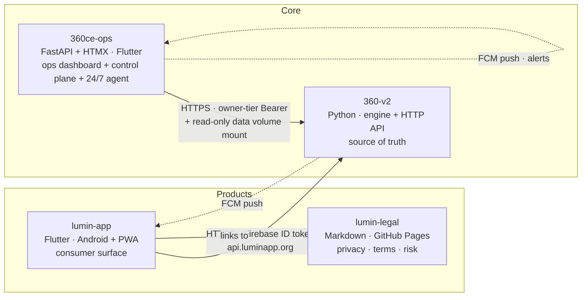
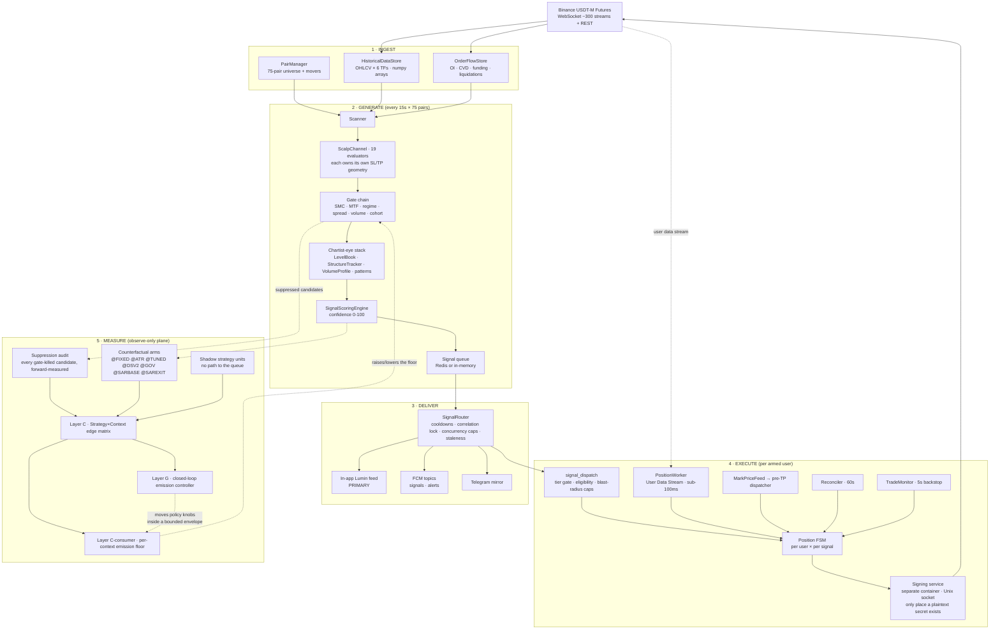
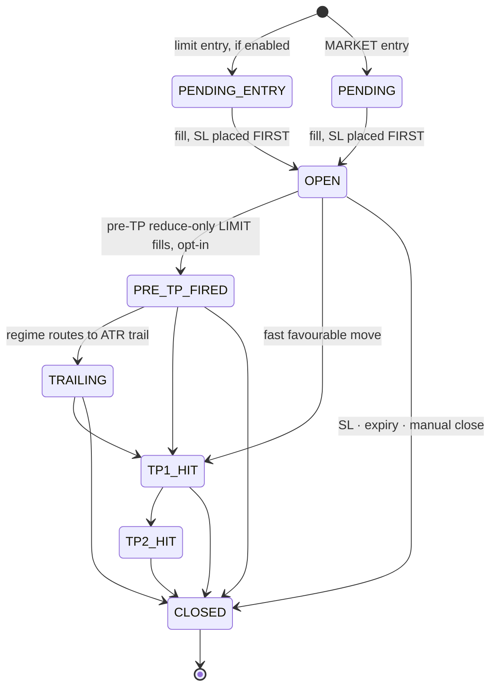

# ARCHITECTURE — the whole system on one map

**Purpose: after ~10 minutes here, a session knows where every piece lives, what
talks to what, and which rules constrain a change — without reading 6,000 lines of
history.**

This is the **map**, not the doctrine and not the news:

| Document | Answers | Size |
|---|---|---|
| **`ARCHITECTURE.md`** (this file) | *What is the system, and where does anything live?* | stable — changes only when a subsystem is added or rewired |
| `OWNER_BRIEF.md` | *What are the rules, and why?* — roles, business rules B1–B18, doctrine | stable — owner-sign-off territory |
| `ACTIVE_CONTEXT.md` | *What happened lately, and what's open?* | append-only, one entry per session |
| `CLAUDE.md` (×4 repos) | *How do I work here?* — protocol, hard limits, conventions, hard-won lessons | per-repo |

**Session-start order:** `auto-detected` GitHub Issues → this file (skim §0–§2, jump to the
subsystem you're touching) → `OWNER_BRIEF.md` → `ACTIVE_CONTEXT.md` (top entry is enough
unless you're resuming a thread).

**One canonical copy.** This file lives in `360-v2` and is pointed at from the other
three repos. It is deliberately *not* mirrored — a drifting mirror is worse than a
pointer (see `CLAUDE.md`, Layer-G lesson: *"the fix for a drifting mirror is not a
second mirror"*).

---

## §0 — The 60-second version

We run a 24/7 crypto-futures scalping signal engine and the products around it.

1. **Ingest** — Binance WebSocket + REST feed a candle/order-flow store for 75 USDT-M
   futures pairs across 6 timeframes.
2. **Generate** — a scanner sweeps every 15s, runs 19 evaluators (17 live) per pair,
   pushes survivors through a gate chain, and scores them 0–100.
3. **Deliver** — A+ (80+) and B (65–79) go to the in-app Lumin feed (primary surface),
   with FCM push and a Telegram mirror. Below 65 is dropped.
4. **Execute** — for subscribers who armed auto-trade, each signal is dispatched
   per-user into a Position FSM that places real Binance orders through an isolated
   signing service.
5. **Measure** — everything that *didn't* emit, plus counterfactual arms on everything
   that did, is forward-measured on real candles into a Strategy×Context edge matrix
   that feeds emission decisions back into step 3.
6. **Control** — the owner reads and steers all of it from `ops.luminapp.org`.

**Money is made** at step 3–4 and **protected** at step 4. **Every claim about
performance** comes from step 5. Confusing those three planes is this system's most
expensive recurring bug — see §3.

---

## §1 — The four repos



| Repo | Owns | Never does |
|---|---|---|
| **`360-v2`** | Signal generation, scoring, execution, entitlement truth, the HTTP API, all engine state | — |
| **`360ce-ops`** | Diagnostics, measurement surfaces, **owner control plane**, 24/7 monitoring agent | Modify engine code; mutate engine state except through owner-gated engine endpoints |
| **`lumin-app`** | Consumer UX, charts, client-side order placement, Play Billing client | Derive money-path truth locally — it renders engine state |
| **`lumin-legal`** | Public legal docs the app and Play Console link to | Assert product behaviour not sourced from `OWNER_BRIEF.md` |

**Brands:** *Lumin* = consumer app. *360 Crypto Eye* = engine / signal source.

**Cross-repo work is normal** — an engine endpoint plus its app UI ships as paired PRs
on a shared branch name. Cross-repo field names are **contracts**: pin them in a test on
the *producing* side, or a rename silently empties a page in another repo (the
`entry_regime` incident, #817).

---

## §2 — The system map



### The two process modes

`API_PROCESS_ISOLATED` in `.env` picks one. **Production runs isolated.**

```
isolated = true  (LIVE on VPS)              isolated = false (local dev)
┌──────────┐  snapshot:*  ┌──────────┐      ┌────────────────────────┐
│  engine  │ ──────────►  │   api    │      │  engine + HTTP in one  │
│  scanner │    Redis     │  HTTP    │      │  process, one loop     │
│  FSM     │ ◄──────────  │  facade  │      └────────────────────────┘
└──────────┘  snapshot:cmd:* └────────┘
      │  shared SQLite volume  │
      └────────────────────────┘
```

- `engine` never serves HTTP; it writes state to Redis via `SnapshotWriter` each cycle.
- `api` serves HTTP on its own event loop and reads Redis through `RedisEngineFacade`.
- Writes that must reach the engine (mode flips, manual take, ledger clears) queue as
  `snapshot:cmd:*` keys and are consumed engine-side.
- Per-user settings go the other way: **API writes SQLite → engine reads a fresh SELECT
  at dispatch** (WAL mode, shared volume). A setting change takes effect on the next
  signal dispatch — no worker cache to invalidate.

---

## §3 — The three planes (read this before changing anything)

Most of the expensive bugs in `ACTIVE_CONTEXT.md` are one plane's code being judged by
another plane's rules. Name the plane you're in before you write a line.

| | **Money path** | **Measurement path** | **Display path** |
|---|---|---|---|
| **What it is** | Anything that changes what emits, what a subscriber sees, or what an order does | Stamping, shadow arms, counterfactuals, forward-resolution, the edge matrix | Ops panels, app cards, truth-report sections, exports |
| **Where** | scanner gates, scoring, router, `signal_dispatch`, FSM, `context_emission_policy`, Layer G | `suppression_audit`, `strategy_edge`, `geometry_ab`, `sar_exit_shadow`, `shadow_strategies` | `360ce-ops/app/routes/*`, `runtime_truth_report`, app UI |
| **Ships** | **Dark-flag-first**: user-visible flag default **OFF**, shadow-measured on a real window, activated only on owner sign-off | **ON the day it ships** — a measurement that ships OFF produces an empty panel and a deferred decision | Normally, via PR |
| **Failure mode** | Real money lost | A verdict that describes nothing — and *looks* full | A true number captioned into a false claim |
| **Non-negotiable** | Blast-radius caps, naked-position invariant, secret handling | Refuse rather than clamp; record a fact where it becomes true; count every fail-open | Measure on the population the page is showing; truncate after filtering |

**Dark ≠ off.** Dark means *invisible to users, fully live to the owner*. Two flags,
never one: measurement **ON**, user-visible effect **OFF**. A dark change that ships
without its ops surface is unfinished.

**Provenance has three states, not two** — and only the router knows the third:

| State | Meaning | Written by |
|---|---|---|
| `suppressed` | a scanner gate killed it | gate chain |
| `enqueued` | passed every scanner gate, `signal_queue.put` accepted it | enqueue site |
| `emitted` | **the router confirmed delivery** | `sar_exit_shadow.promote_to_emitted`, from the router, only |

Stamping `emitted` at enqueue once inflated the only population allowed to justify a
live change by ~30×, non-randomly. `provenance` (display/analysis) and
`strategy_edge.source` (routing) are different fields that share the word "emitted" —
never re-derive one from the other.

---

## §4 — Subsystem detail

### 4.1 Ingest

| Piece | Module | Notes |
|---|---|---|
| Pair universe | `src/pair_manager.py` | Top USDT-M futures by volume + promoted "movers". **A symbol can rotate out** — anything keyed on the live universe goes blind to what left it (#815) |
| Candle store | `src/historical_data.py` | 6 timeframes, **numpy arrays** — never boolean-test them (`is None` / `len()`); `update_candle` appends only on `k["x"]`, so the newest bar is the last *closed* one |
| Order flow | `src/order_flow.py` | OI, CVD, funding, liquidations |
| WS transport | `src/bootstrap.py`, `src/main.py` | Multi-connection, heartbeat, auto-reconnect, REST fallback |

### 4.2 Generate

`Scanner` (`src/scanner/__init__.py`) — 15s cadence × 75 pairs:

```
per pair → 19 evaluators (src/channels/scalp.py, _evaluate_*)
         → gate chain      smc_hard_gate · trend_hard_gate · mtf_gate ·
                           ranging/countertrend family blocks · min_confidence_pass
         → chartist-eye    LevelBook · StructureTracker · VolumeProfile · chart_patterns
                           (scoring only — never invents a setup; bonuses bounded)
         → SignalScoringEngine  (src/signal_quality.py, src/confidence.py) → 0-100
         → _enqueue_signal (universal SL floor 0.80%)
```

- **Every evaluator owns its own SL/TP geometry (B7).** No shared universal formula.
- **`SetupClass`** (`src/signal_quality.py`) is stringly coupled to `_MAX_SL_PCT_BY_SETUP`
  keys and telemetry event names — rename in all three places at once.
- **Score a setup on the evidence that defines it** — a low-volume pullback entry is
  low-volume *by design*; scoring it off the entry candle guarantees it never clears 65.
- Tiers: **A+ 80–100** and **B 65–79** → delivered free, in full. **< 65** → dropped.

### 4.3 Deliver

`SignalRouter` (`src/signal_router.py`) is a second, independent filter layer — it drops
most of what it dequeues: correlation lock, per-symbol and per-channel cooldown,
per-channel concurrency cap, correlation-group limit, global same-direction throttle,
TP/SL sanity, staleness. **Enqueue is not dispatch.**

| Surface | Path | Role |
|---|---|---|
| In-app Lumin feed | `src/signal_history_store.py` → `/api/signals` | **Primary** (B1) — full levels, free |
| FCM push | `src/push_notifications.py`, topics `signals` / `alerts` | Alerting only |
| Telegram | `src/telegram_bot.py` | **Mirror only.** Works in-region; its wider role is a separate owner session |

Control (kill switch, mode flips, manual close) is **ops-only** — it needs the audit
trail. Alerting is read-only, so FCM and Telegram are both fine.

### 4.4 Execute

`signal_dispatch` (`src/execution/signal_dispatch.py`) fans one signal out per armed
user, fresh-reading that user's settings, then drives a **Position FSM per user × per
signal**.



States are pinned in `src/execution/position_state.py`; transitions in
`position_fsm.py`. **Default exit profile is TP1-full against a fixed SL** — pre-TP
banking and invalidation kills survive only as per-user opt-ins (B17).

| Driver | Module | Cadence |
|---|---|---|
| `PositionWorker` | `position_worker.py` | Binance User Data Stream, sub-100ms transitions |
| Mark-price / pre-TP | `mark_price_feed.py`, `pretp_dispatcher.py` | ~1/sec per open symbol — **the hottest loop in the system** |
| `Reconciler` | `reconciler.py` | 60s diff; force-closes anything open past the age cap |
| `TradeMonitor` | `src/trade_monitor.py` | 5s backstop |
| Manual take | `manual_take.py` via `snapshot:cmd:take` | Server-side "take this signal" |

**Order-type doctrine:** entry = MARKET; profit-taking = **reduce-only LIMIT** (maker
fill, zero slippage, survives an engine blip); protection = MARKET reduce-only.

**Safety envelope — never weakened:** symbol allowlist, per-user rate limit (10/min,
50/hr), per-user position cap, global kill switch, global circuit breaker (>10
rejections/60s), per-user circuit breaker (>3/5min), leverage cap. **Naked-position
invariant:** SL placement failure force-closes at market.

**Key custody:** user keys are KMS-encrypted in Firestore (`firestore_keystore.py`,
cached); the plaintext secret materialises only inside the signing-service process for
one request. Connect-time validation auto-rejects any key with withdraw permission.

### 4.5 Measure — the Autonomous Portfolio (Layers A–G)

Edge lives in `session × regime × strategy` cells, not in a global confidence number.

| Layer | Module | State |
|---|---|---|
| A — market context vector | `src/market_context.py` | LIVE |
| B — strategy registry / affinity | `src/strategy_portfolio.py` | LIVE |
| C — Strategy×Context edge matrix | `src/strategy_edge.py` | LIVE — **everything routes on it** |
| C→consumer — per-context emission floor | `src/context_emission_policy.py` | **LIVE, money path** |
| D — allocator | `src/strategy_allocator.py` | Recommendation-only — **consumed by nothing** |
| G — closed-loop emission controller | `src/emission_controller.py` | **LIVE**, self-tuning in a bounded envelope |

Feeders: `suppression_audit.py` (every gate-killed candidate, forward-measured →
per-gate KEEP/TUNE/DROP), `shadow_strategies.py` (4 units with no path to the queue),
and the counterfactual arms (`geometry_ab.py`, `tuned_variants.py`, `staleness_v2.py`,
`sar_exit_shadow.py`).

**Four standing cautions:**
1. **Measurement arms are not strategies.** `@FIXED @ATR @TUNED @DSV2 @GOV @SARBASE
   @SAREXIT` are stamped from the *same candidates* as real rows. Authoritative list:
   `geometry_ab._VARIANT_SUFFIXES`; ops mirrors it in `strategy_lab.MEASUREMENT_SUFFIXES`
   — keep them in sync. **Any code keyed off the matrix inherits the arms** — before
   writing matrix-derived state, ask *"who reads this key, and are they keyed the same
   way?"*
2. **Counterfactuals are optimistic** (~0.38R measured). Never quote one as an expected
   live result. All R is **cost-aware** since W1/W2 (`src/trade_costs.py`).
3. **Zero emissions ≠ broken.** Fully gated + measured-negative is the gates working;
   fully gated + measured-*positive* is money on the table. `gated_path_verdict`
   distinguishes them.
4. **Wait for a fresh window** after any scoring or cost change — rolling per-cell
   windows keep serving pre-change data.

### 4.6 Control and observation — `360ce-ops`

| Surface | Route | Reads |
|---|---|---|
| Pulse / positions / signals | `/pulse` `/positions` `/signals` | Engine REST |
| Strategy Lab | `/strategy-lab` `/raw-edge` `/emission-controller` | Edge matrix + gate audit |
| Dark measurement | `/dark-signals` `/sar-exit` | Shadow ledgers |
| Recorded outcomes | `/track-record` `/performance` | `signal_performance.json` |
| Reconstructed what-ifs | `/profit` `/exit-backtest` | Candle replay |
| Diagnostics | `/diag/*` `/data` `/truth` `/invalidations` | Data volume · monitor-logs · `docker exec` diag scripts |
| **Control plane** | `/control/*` | Owner-gated engine endpoints |
| Alerts | `/alerts` | Monitoring agent's Redis state |

**Control doctrine:** owner-gated end to end · every action audited (best-effort, never
blocking) · POST→redirect→GET with explicit confirm on destructive actions · **the
engine is the source of truth** — ops reads state back after every write, never holds it.

**Recorded vs reconstructed is a hard line.** `/track-record` is recorded reality only.
A reconstructed number wearing a track record's name is the most dangerous artefact this
system could produce — it is what a subscription decision would rest on.

**24/7 agent** (`app/agent/`, own container, 60s cycle): Tier-0 detectors — naked
position, signing service down, engine/Redis stale, fire-rate anomalies, FSM
distribution, deploy health. Redis-backed dedup/escalation FSM; pages via FCM; files
GitHub Issues tagged `auto-detected` (**read these at session start**); heartbeats to
healthchecks.io.

### 4.7 The consumer app — `lumin-app`

Flutter, Android (Play production) + installable PWA. Compile-time channel via
`lib/app/distribution.dart` — `play` builds have the self-updater inert.

```
main.dart → Firebase.init → NotificationService → AppConfig.load
  → WelcomePage → WelcomeConsentPage (18+ · risk · not-advice)
  → Firebase phone-OTP AuthGate → NavShell
       Pulse · Signals · Charts · Trade · Menu
```

- **`LuminRepository` (`lib/data/repository.dart`) is the single seam** between UI and
  data — `MockRepository` vs `HttpRepository` chosen at startup. Pages never do HTTP.
  New data behaviour = a new method on **both** implementations.
- **Two Binance execution paths, never conflated:** *client-side* (`binance_client.dart`,
  device signs, keys in `flutter_secure_storage`, engine never sees them) and
  *server-side* (`POST /api/auto-trade/take`, engine dispatches on a KMS-held key).
- **Entitlement is server-side truth.** Play `purchaseToken` → `POST /api/billing/play/verify`
  → engine sets tier. Client-side gating is UX only.
- **Charts** are `webview_flutter` + vendored TradingView Lightweight Charts, fed
  straight from Binance public REST — no key, no engine load.
- **Render engine state; never derive it.** A card showing "armed" while dispatch
  silently skips is a bug class this repo has already paid for.

---

## §5 — State map — where every fact lives

| Store | Holds | Lifetime | Notes |
|---|---|---|---|
| **Redis** `snapshot:*` | `engine_state` `signals_all` `positions_diag` `activity_all` `alerts` `agents_all` `tickers` | seconds | Engine→API bridge in isolated mode |
| **Redis** `snapshot:cmd:*` | `set_mode` `take` `reset_signals` `clear_sar_ledger` | one-shot | API→engine command queue |
| **Redis** (ops) | `alert:state:{fingerprint}` | escalation window | Agent dedup FSM; in-memory fallback |
| **SQLite** (shared volume) | `users` `user_auto_trade_settings` `user_pretp_settings` `user_invalidation_settings` `user_symbol_management` `paper_trades` `user_paper_subscriptions` `play_purchases` `user_trials` `user_referral_codes` `user_referral_redemptions` `user_reward_grants` `referral_commissions` | durable | API writes, engine reads fresh at dispatch (WAL) |
| **Firestore** | KMS-encrypted Binance keys, per-user position state | durable | **Reads dominate the cloud bill** — every hot-path reader must be cached and invalidation-gated |
| **Cloud KMS (HSM)** | Master key | durable | Engine holds Decrypt IAM only |
| **`data/*.json`** (volume, mounted read-only into ops) | `signal_performance.json` `signal_history.json` `invalidation_records.json` `strategy_edge_store.json` `suppressed_candidates.json` `emission_controller_store.json` `market_context.json` `feature_liveness.json` `dispatch_log.json` `pnl_history.json` `alerts.json` `level_book.json` `circuit_breaker_status.json` … | durable | The measurement plane's substrate |
| **`monitor-logs` branch** | Truth report, runtime audit artifacts | per CI run | `git show origin/monitor-logs:monitor/report/truth_report.md` |

**Cost rule, learned at ₹4,552/month:** a single uncached Firestore query on the
mark-price tick was 99.9% of the GCP bill. **Never add an uncached read or write to a
per-tick, per-scan, or per-order loop.** Cache it and gate the cache on an explicit
invalidation signal (`position_state.get_write_generation()`), with a defensive TTL
bound. Firestore bills under the **"App Engine"** line — an App Engine charge with no
App Engine service deployed is Firestore.

---

## §6 — Deployment topology

```
VPS (Ubuntu · Docker Compose · 24/7)          Cloudflare
┌────────────────────────────────────┐        api.luminapp.org  → engine api
│ 360scalp-v2-engine     scanner·FSM │        ops.luminapp.org  → ops web
│ 360scalp-v2-api        HTTP        │
│ 360scalp-v2-redis      bridge      │        GitHub Pages
│ 360scalp-v2-signing    Unix socket │        mkmk749278.github.io/lumin-legal
│ 360scalp-v2-autoheal   restarts    │
│ 360scalp-v2-watchdog   liveness    │        Google Play
│ ops web · ops agent · ops redis    │        org.luminapp.lumin  (AAB from CI)
└────────────────────────────────────┘
```

| Repo | Push to `main` → |
|---|---|
| `360-v2` | GitHub Actions → `bash deploy.sh` on VPS, **~45s to live**. Doc-only paths are `paths-ignore`'d |
| `360ce-ops` | Auto-deploy, ~60s |
| `lumin-app` | Full CI build → auto-created GitHub Release (sideload APK + Play AAB) |
| `lumin-legal` | GitHub Pages deploy |

**A `main` merge reaches real users.** That is the whole reason for the dark-first rule
in §3. Android platform scaffolding is **not checked in** — CI regenerates `android/`
with `flutter create` and patches it; native config changes are edits to the workflow's
patch steps.

---

## §7 — Invariants that constrain every design

Violating one of these is never a trade-off to be weighed; it's a blocked design.

| # | Invariant |
|---|---|
| 1 | A position never sits OPEN without a stop |
| 2 | A Binance secret is never logged, never written to disk, never surfaced in an error |
| 3 | A key with withdraw permission is auto-rejected — no override |
| 4 | Blast-radius caps are never disabled or weakened |
| 5 | Nothing is pushed to `main` directly; every change ships via PR |
| 6 | Performance numbers are never fabricated, and a reconstructed number never wears a recorded label |
| 7 | No uncached read/write on a hot path |
| 8 | No silently swallowed exception in a data/measurement path — every fail-open calls `fail_open.record` |
| 9 | Candle/series arrays are never boolean-tested |
| 10 | A money-path change ships dark, shadow-measured, owner-signed-off — with its ops surface |
| 11 | Every new measurement pipeline registers a liveness probe |
| 12 | Refuse, don't clamp — an input that can't support the computation returns None/INSUFFICIENT |

**Owner sign-off required** (never auto-merge): signing service / KMS / connect-time
validation / blast-radius caps · Position FSM transitions · new evaluator paths or
scoring models · Business Rules · paid-channel routing · regime-per-exit design ·
substantive legal-content changes.

---

## §8 — Where do I look when…

| Symptom | First stop |
|---|---|
| "No signals firing" | Suppression telemetry — every gate rejection is tagged. Then `gated_path_verdict` before assuming a fault |
| A number on an ops page looks wrong | Which plane (§3)? Then: is it measured on the population the page shows? Was it truncated before filtering? |
| A panel is full but meaningless | A field one repo reads and no repo writes — check the producing side (#817) |
| A verdict flipped sign | Unit of evidence — are overlapping entries into one move counted as independent rows? (#816) |
| Auto-trade "armed" but nothing happens | `signal_dispatch` gates: tier gate, eligibility, caps, circuit breakers. The dispatch log, not the UI |
| A Binance-API symptom | **Vendor changelog first** — `developers.binance.com/docs/derivatives/change-log`. Six PRs were once spent instrumenting a decommissioned endpoint |
| Cloud bill spiked | Billing → group by SKU, then Firestore → Usage. Not auth |
| A feature silently flat-lined | `feature_liveness.py` probes + `fail_open` counters |
| Engine state vs app disagreement | The engine is the source of truth; check what the app derived locally |
| Something rotated out of the universe | Any watchdog keyed on the live universe is blind to it by construction (#815) |

**Diagnosis order is always: real data → vendor docs → external verification → code.**

---

## §9 — Keeping this file true

Update `ARCHITECTURE.md` in the same PR when a change:

- adds, removes, or renames a **subsystem, container, or store**;
- changes a **cross-repo contract** (endpoint, field name, auth scheme);
- moves a Layer A–G component's **state** (recommendation-only → live, dark → active);
- adds an **invariant** or a new plane-crossing rule.

Do **not** update it for a bug fix, a tuning change, or a session narrative — those
belong in `ACTIVE_CONTEXT.md`. If this file and the code disagree, the code is right and
this file is a bug: fix it the same day.
