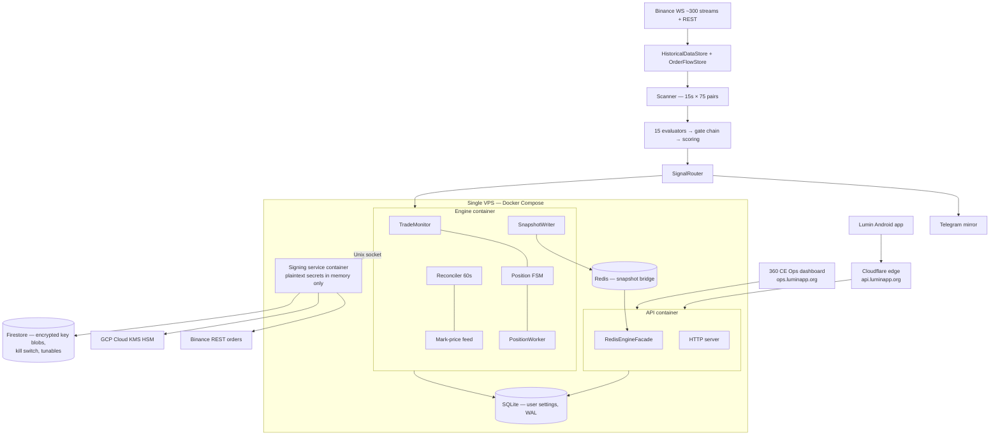
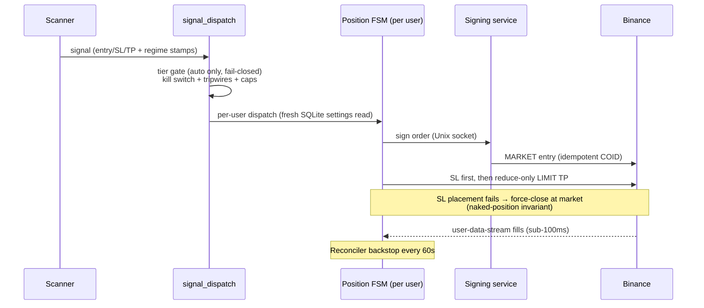

# Lumin / 360 Crypto Eye — Institutional-Grade Audit

**Audit date:** 2026-07-10
**Scope:** All four repositories — `360-v2` (signal + execution engine, ~101k lines Python), `lumin-app` (Flutter Android app, ~30k lines Dart), `360ce-ops` (ops dashboard / control plane), `lumin-legal` (legal documents)
**Perspective:** Senior blockchain architect · cybersecurity expert · fintech auditor · quantitative trading systems analyst
**Method:** Direct code review, documentation review (`OWNER_BRIEF.md`, `ACTIVE_CONTEXT.md`, research docs), infrastructure config review, and the project's **own live performance telemetry** (truth reports, Profit-Lab counterfactuals, session logs). No performance numbers in this report are invented — every figure is taken from the project's own recorded data.

---

## 1. Executive Summary

### What this project is, in one paragraph

A 24/7 automated crypto signal engine scans 75 Binance USDT-M futures pairs every 15 seconds, generates scalp signals through 15 evaluators, scores them, and delivers them free to a live Android app on the Google Play production track. Paying subscribers (₹1,000–₹2,000/month) get their trades automated on their own Binance accounts via a server-side execution system with a hardware-security-module-backed key custody design. The whole system is built and operated by **one founder plus an AI engineering partner** on **one VPS**.

### Overall project maturity: **Early Production**

The engineering culture is far above what its size suggests. The business-critical ingredient — **a proven profitable signal edge — does not yet exist**, by the project's own honest measurements.

### Production readiness assessment

| Dimension | Verdict |
|---|---|
| Can it run 24/7 and execute real trades safely? | ✅ Yes — and it is doing so today |
| Can it lose a user's whole account through a software bug? | 🟡 Unlikely — blast-radius caps limit damage to ~$500/position, withdraw keys auto-rejected |
| Is the strategy it automates profitable for the user? | ❌ **Not yet proven.** The book has been net-negative over every long measurement window |
| Would it survive the VPS dying? | 🟡 Partially — positions are protected by exchange-resident stops, but there is no failover and no verified data backup |
| Would it survive the founder being unavailable for a month? | ❌ No |
| Would it survive regulatory scrutiny in India? | ❌ Unassessed — no legal entity, no counsel on record |

### Key strengths

1. **Exceptional key-custody architecture for its size.** Binance API secrets exist in plaintext only inside a separate signing-service container's memory; secrets are envelope-encrypted with a Cloud KMS (HSM) master key; keys with withdraw permission are auto-rejected with no override. This mirrors the post-breach "Sign Center" pattern used by 3Commas — most retail signal bots never get close to this.
2. **Real, layered blast-radius controls, actually wired.** Symbol allowlist, 5 orders/min & 30/hr per-user rate limits, $500 position cap, per-user and global circuit breakers, a <5s global kill switch, a naked-position invariant (no open position without a stop, ever), and idempotent client order IDs (`lumin_<signal_id>_entry`) preventing duplicate orders.
3. **A ruthlessly honest data culture.** The system measures itself against counterfactuals (Profit-Lab simulator), publishes daily truth reports, classifies its own kills as PROTECTIVE/PREMATURE, and its governing doctrine forbids fabricating performance numbers. When the exit machinery was proven to *destroy* 19% of edge, it was removed. This honesty is rare and is the single most investable trait of the project.
4. **Documentation quality at institutional level.** The owner brief, active-context session log, and research documents (regime validation, LevelBook placebo test, scoring audit) constitute a genuine audit trail. A new engineer could reconstruct the entire history of the system.
5. **Strong test and change discipline.** ~6,000 tests passing, ruff/mypy-clean, CI gate on every PR, dark-flag-first shipping for money-path changes, owner sign-off gates on execution logic, hourly liveness monitoring plus daily truth reports filing auto-detected GitHub issues.

### Critical risks

1. 🔴 **The product's core promise is unproven.** By the project's own numbers: 42% win rate against a 47% breakeven requirement, −0.10% expectancy per signal, book at −6.65% *even under an idealized exit*, and a confidence score that **cannot rank its own signals** (higher-confidence bands performed *worse*). A 3-day window after the latest fixes showed +12.1% net — but on 85 signals, which is statistically meaningless. **Charging users to automate a negative-expectancy strategy is the existential risk.** Everything else in this report is secondary.
2. 🔴 **Single VPS, single region, no failover, no verified backups.** The engine, API, Redis, signing service, SQLite user DB, and all JSON state files (cohort stores, loss streaks, paper books, invalidation records) live on one machine. No backup script exists in the repository. If the disk dies, live positions survive (stops rest on Binance) but user settings, performance history, and learning-state are gone.
3. 🔴 **Regulatory exposure is unmanaged.** An unincorporated individual in India is selling a paid crypto-derivatives auto-execution service. India's regulatory posture on crypto derivatives is hostile-to-ambiguous, the Google Play "financial features" framing is described in the project's own docs as "load-bearing", and there is no legal entity, no counsel, no KYC, and no formal compliance review on record.
4. 🟠 **Recurring production incident pattern: stale/frozen price data blinding the safety backstops.** Three sessions in a row (44, 45, 46) dealt with variants of the same failure: a symbol drops out of the scan universe, its candle store keeps serving a frozen price, and SL/TP/trailing protection silently goes blind for hours on an open position. Each instance was fixed well, but the *class* keeps recurring, and incidents are being discovered by the owner's screenshots, not by automated alerting.
5. 🟠 **Bus factor of one.** One founder holds the VPS keys, GCP account, Play Console, Binance relationship, and all operational knowledge. The AI-session logs mitigate knowledge loss but not access loss.

### Overall risk rating: 🔴 **HIGH**

Not because the engineering is bad — it is unusually good — but because the business rests on an unproven trading edge, one machine, one person, and an unexamined regulatory position.

### Investor confidence score: **4 / 10**

```
Engineering & safety culture   ████████░░  8/10  ← would be fundable on its own
Proven trading edge            ██░░░░░░░░  2/10  ← the product promise, unproven
Infrastructure resilience      ████░░░░░░  4/10
Legal/compliance posture       ██░░░░░░░░  2/10
Team resilience                ██░░░░░░░░  2/10
─────────────────────────────────────────────
Blended investor confidence    ████░░░░░░  4/10
```

An investor today would be buying a well-built machine that has not yet demonstrated it makes money for its users. The score moves fast (to 6–7) if a 60–90-day audited live window shows positive net-of-fees expectancy.

---

## 2. System Architecture Audit

### 2.1 Architecture overview



### 2.2 What is done well

- **Process isolation is real, not cosmetic.** The engine (money path) and API (user-facing HTTP) run in separate containers with separate event loops, bridged by Redis snapshots. An API-side slowdown or crash cannot stall the scanner, FSM, or stop management. This split was implemented after real contention problems, not speculatively.
- **The signing service is a genuine custody boundary.** Engine → Unix socket → signing container → KMS. The engine container has no KMS decrypt path of its own. This is the correct trust topology.
- **Caching discipline is codified.** After a single uncached Firestore query on the tick path caused 99.9% of the GCP bill, a "no uncached reads on hot paths" rule became a hard limit with a reference implementation. Keystore reads are cached 30s, kill switch 5s, tunables 5s — all with invalidation-aware patterns.
- **Graceful degradation:** Redis is optional (in-memory fallback); the engine is designed to survive Binance API degradation (B6).

### 2.3 Database design — fragmented but workable at this scale

| Store | Holds | Risk |
|---|---|---|
| Firestore | Encrypted key blobs, kill switch, runtime tunables, per-user disable flags | Managed, durable — the strongest store |
| SQLite (WAL, shared volume) | Per-user settings, overrides, trade records | Single file on one disk; fine at 14 users, a wall at ~thousands of concurrent writers |
| Redis (128 MB, allkeys-lru) | Engine→API snapshots | Ephemeral by design — acceptable |
| Flat JSON files (`data/*.json`) | Cohort edge store, loss streaks, invalidation records, paper books, signal performance | ⚠️ Non-transactional, non-backed-up, silently corruptible. These files now feed **live gating decisions** (cohort edge gate) — they have become money-path state stored in the weakest tier |

**Finding:** state that started as "diagnostics" (JSON files) has been promoted into the money path (cohort gate suppresses live signals based on `cohort_edge_store.json`). Money-path state deserves a transactional store.

### 2.4 Single points of failure

```
SPOF map (each ✗ = total or partial outage if it fails)

VPS machine            ✗✗✗  everything except resting Binance orders
Docker daemon          ✗✗✗  same
Redis container        ✗    API goes stale (engine keeps trading)
SQLite file            ✗✗   dispatch reads user settings per signal
Signing container      ✗✗   no new orders; existing stops safe on exchange
Binance (sole venue)   ✗✗✗  no fallback exchange
GCP (KMS+Firestore)    ✗✗   no signing, no kill-switch reads (cached 5s)
Cloudflare             ✗    app offline; engine unaffected
The founder            ✗✗✗  no second operator exists
```

**The saving grace** — and it is a deliberate, correct design decision — is that protective stops are *resting orders on Binance*, so a total engine outage leaves users with bracket protection rather than naked positions. The reconciler force-closes stale positions on recovery. This is the right failure posture for a single-machine deployment.

### 2.5 Scaling limitations

- Scanner cost grows linearly with pairs × evaluators; a 1 GB / 1.5 CPU container bound is already set. Fine to ~hundreds of users (signals are broadcast, not per-user).
- **Per-user execution is the scaling wall:** per-user user-data-stream WebSockets, per-user FSM workers, per-user rate/breaker counters held **in process memory** ("in a multi-process deployment these would need Redis" — the code says this itself). At ~hundreds of auto-trade users a single process runs out; the redesign is known but unbuilt.
- SQLite fresh-SELECT-per-dispatch is elegant at 14 users and adequate to low thousands; beyond that, Postgres.

**Verdict:** the architecture is honest about being single-tenant-scale and does the right things at that scale. There is no hidden fantasy of scale, but there is also **no written scale-out plan, no HA, and no DR runbook.**

---

## 3. Security Audit

### 3.1 Scorecard

| Area | Rating | Notes |
|---|---|---|
| Exchange key custody | 🟢 Strong | KMS envelope encryption, separate signing process, withdraw auto-reject, IP whitelist required |
| Secret hygiene doctrine | 🟢 Strong | "Never log / never write to disk / never surface in errors" as hard limits |
| Blast-radius controls | 🟢 Strong | Allowlist, rate limits, caps, dual circuit breakers, kill switch |
| App authentication | 🟡 Adequate with caveats | Hand-rolled JWT (see below) |
| API authorization | 🟡 Adequate | Owner tier gates writes; static admin token bypass exists |
| API rate limiting / DDoS | 🟡 Thin | OTP issuance is rate-limited; no evident global request throttle — reliance on Cloudflare |
| Server hardening | 🟡 Unverified | No hardening evidence in repo (no fail2ban/ufw/SSH config as code) |
| Mobile app security | 🟡 Adequate | Secure storage used well; **no code obfuscation configured** |
| Container security | 🟠 Gaps | Signing container runs as **root**; socket is chmod **0666** |
| Formal testing | 🔴 Absent | No penetration test, no external review, no dependency scanning/SCA evident |

### 3.2 Authentication & JWT implementation

The API mints **anonymous device-bound JWTs** (HS256), stored in encrypted secure storage on-device, silently refreshed, with a `tier` claim (`free < assist < auto < owner`) and 7-day TTL. The money-path gate (hands-off execution only for `auto` tier) is enforced server-side and fail-closed. This is a sound model.

**Issues:**

| # | Severity | Exploit likelihood | Issue | Mitigation |
|---|---|---|---|---|
| S-1 | **Medium** | Low | JWT is **hand-rolled stdlib HS256** to avoid a PyJWT dependency. The implementation looks careful (constant-time HMAC compare available via `hmac.compare_digest` — verify it is used), but hand-rolled token crypto has no external eyeballs and invites subtle bugs (alg confusion, padding, clock skew). | Adopt PyJWT/jose, or commission a focused review of `src/api/auth.py`; add test vectors from RFC 7519 |
| S-2 | **Medium** | Medium | **Single shared HS256 secret** signs all tiers including `owner`. Whoever obtains the secret (VPS compromise, env leak) can mint owner-tier tokens and flip engine state. | Move owner-tier auth to a separate secret or asymmetric keys; rotate on schedule |
| S-3 | **Medium** | Low | **Static admin-token bypass** of the tier system exists. Static long-lived credentials on a control surface are a standing target. | Replace with short-lived owner JWTs only; if kept, bind to source IP |
| S-4 | Low | Low | Legacy `all-access` "testing-phase god mode" tier still ranks above `auto` in code. Dead privilege tiers get forgotten. | Delete the tier now that production is live |

### 3.3 API surface, rate limiting, DDoS

- OTP issuance burns the rate-limit slot **before** checking user existence — a nice enumeration defence, deliberately designed.
- **No global per-IP/per-token request throttle was found on the API server** — protection relies on Cloudflare in front of `api.luminapp.org`. Cloudflare's free tier absorbs volumetric attacks but not low-and-slow application-layer abuse of expensive endpoints.
- The API container binds to host loopback only, proxied by nginx — WAN cannot reach it directly. Good.

**S-5 (Medium / Medium):** add application-layer rate limiting (per-token and per-IP) on all mutating and expensive endpoints, not just OTP.

### 3.4 Container & VPS security

- **S-6 (Medium / Low):** the signing service — the most sensitive process in the system — runs as **root** (`user: "0:0"`) and chmods its socket **0666**, because of an AppArmor/named-volume bind issue. The repo's own comment says "the security boundary is the container, not the Linux user." That is true until a container-escape or a same-host process abuses the world-writable socket. Fix the volume ownership (init-container `chown`, or `driver_opts` uid) instead of accepting root+0666.
- **S-7 (Medium / Unknown):** no server-hardening configuration exists as code (SSH policy, ufw, fail2ban, unattended-upgrades, Docker socket exposure on the ops box). The ops dashboard mounts `docker.sock`, which is root-equivalent on that host — acknowledged in its own docs as owner-only-acceptable, but it means the ops web app's single password is transitively a root credential for the VPS.
- **S-8 (High / Low):** **the ops dashboard is a single-password gate protecting a kill switch, live/paper flips, and (transitively via docker.sock) the host.** One static password, no 2FA, no IP allowlist mentioned. Add TOTP 2FA or mTLS/Cloudflare Access in front of `ops.luminapp.org`. Low likelihood (obscure target) but the impact is total.

### 3.5 Mobile application security

- Binance keys for the Assist tier are stored in `flutter_secure_storage` (Android Keystore-backed), namespaced per user — correct.
- HMAC signing for client-side orders is done on-device with the `crypto` package — keys never leave the device for Assist tier. Correct trust model.
- **S-9 (Medium / Medium):** **No R8/ProGuard obfuscation or `--obfuscate` flag found.** A Play-distributed app that handles exchange API keys and gates paid features client-side (Assist gating is client-side per B16) should be obfuscated; without it, the Assist paywall is trivially patchable and internal endpoints/logic are readable.
- **S-10 (Low / Low):** the app contains a self-update path (download + install APK from GitHub Releases via `dio` + `open_filex`). On the Play production track this is both a Play-policy risk and a supply-chain surface (a compromised GitHub release = arbitrary APK install prompt). Retire it now that Play distribution is live.
- No certificate pinning was observed for `api.luminapp.org` (Low; Cloudflare cert rotation makes pinning operationally costly — acceptable to skip, note it consciously).

### 3.6 Compliance with security standards (summary)

| Standard | Verdict |
|---|---|
| **OWASP Top 10 (web/API)** | Mostly addressed: injection surface small (no raw SQL observed in spot checks; parametrize everywhere), authn/authz thought through, SSRF surface minimal. Gaps: rate limiting (API4:2023), security logging/alerting for auth events, dependency/SCA scanning |
| **OWASP MASVS (mobile)** | L1 mostly met (secure storage, no secrets in code observed); fails resilience requirements (no obfuscation, no root/tamper detection — the latter is acceptable for this threat model) |
| **OWASP API Security Top 10** | BOLA/BFLA: single-tenant engine with tier gates — adequate. API4 (resource consumption): thin. API8 (misconfig): signing-as-root, 0666 socket |

**Security bottom line:** the *crypto-custody* security — the part that can lose user funds to theft — is genuinely strong. The *operational-perimeter* security (ops password, root container, no pentest, no obfuscation) lags behind it and is where a real attacker would go.

---

## 4. Trading Engine Audit

### 4.1 Signal generation & strategy implementation

15 evaluator paths (liquidity sweeps, whale momentum, trend pullback, liquidation reversal, breakouts, SR flip, funding extremes, compression breaks, divergence/continuation, failed auction, MA cross) implement a coherent SMC + order-flow scalping doctrine: **HTF defines structure, LTF times entry**; each evaluator owns its SL/TP geometry (no universal formula); soft penalties preferred over hard blocks. The doctrine is written down, argued for, and — unusually — *revised when data contradicts it*.

**Strengths:**
- Direction-agnostic by design, with macro gates (CT_LONG / CT_SHORT vs. the weekly BTC macro classifier) added only after data showed counter-macro trades carried the losses.
- The regime classifier was **forward-validated against its own data** and honestly found mostly non-predictive (only QUIET is real) — and consumption was adjusted accordingly. The LevelBook was placebo-tested and found ~indistinguishable from an offset control. Very few retail shops ever test their own indicators against placebos.
- An invariant test now guarantees every emitted setup is registered in channel sets, regime sets, and display labels — closing the "evaluator silently dead since ship" bug class (MA_CROSS burned ~190k evaluations while hard-rejected before scoring).

**Weaknesses:**
- **The confidence score cannot rank signals** — the project's own scoring audit concluded it is "an uncalibrated presence-checklist" whose 75–80 band performed *worst* (30% win). The replacement (Wilson-bounded cohort-edge expectancy per setup × side × regime family × macro) is the right idea and is mid-rollout, but today the number shown to users as "confidence 82" does not mean what a user thinks it means. **This is a user-trust risk, not just a modelling one.**
- 15 paths × dozens of gates × per-setup overrides is a large parameter surface maintained by rapid iteration on small live windows — a structural **overfitting engine** (see §4.4).

### 4.2 Risk management, position sizing, leverage, drawdown

| Control | Status |
|---|---|
| Fixed SL on every position (naked-position invariant, force-close on SL placement failure) | ✅ Enforced in FSM + reconciler backstop |
| Universal SL floor 0.80%; per-setup max-SL caps; noise-floor widening ≥1×ATR(1h) capped 3% with **risk-constant notional shrink** | ✅ The widen-stop-shrink-size coupling is textbook-correct |
| Position sizing | `notional_usd` per user, capped $500 default / $2,000 max — fixed-notional, not volatility- or equity-fraction-based. Simple and safe; not capital-efficient |
| Leverage | User-set on Binance; engine caps ≤30× per B12. The app's risk doc is honest that leverage belongs to the user |
| Drawdown protection | Daily-loss kill switch, loss-streak cooldown escalation (1h→2h→4h per symbol×setup×direction), global + per-user circuit breakers | ✅ |
| Duplicate prevention | Idempotent `newClientOrderId` per signal + restart-proof active-duplicate dispatch guard (added #707 after a live duplicate) | ✅ now; was a gap until July |

**Gap (T-1, High):** there is **no portfolio-level exposure control** — per-position caps exist, but N concurrent positions can all be correlated longs on alt-perps that move as one asset in a BTC dump. The engine's own data shows alts "couple to BTC harder on the downside." A max-net-directional-exposure cap (e.g., max 3 same-direction positions, or beta-weighted cap) is missing.

**Gap (T-2, Medium):** auto-trade entries are **MARKET-at-dispatch** while the signal book and manual users use a limit entry zone — so ~⅓ of signals in a clean window were "never filled" for the book but **real fills for paying auto users**, at worse prices with a stale thesis. The project knows this (FSM LIMIT-entry design doc exists, owner chose the fix); until it ships, **paid auto users systematically get a worse strategy than the one being measured.** This is the most important open engine item.

### 4.3 Exit logic

The exit history is the project's best and worst story at once: an elaborate pre-TP/invalidation exit machine was built, then the Profit-Lab counterfactual on 494 live signals showed it *destroyed* 19.14% versus a plain TP1-full exit — and it was removed as the default. The current default (TP1-full against a fixed SL, maker-fill reduce-only LIMIT for profit legs, MARKET only for protection) is simple and fee-aware. Break-even arming was re-tuned twice after data showed it scratching 84%-eventual-winners; movers got a banked-partials + trailed-runner policy days ago.

**Concern:** exit policy has changed 4 times in 6 weeks. Each change is data-justified, but users' realized results are a moving blend of regimes-of-the-week. See §4.4.

### 4.4 Overfitting risk — the central quantitative concern

```
Decision windows used for recent live changes:
  #702 verdict ............ 85 signals / 3 days   ⚠️
  Session-43 study ........ ~300 signals / 7 days ⚠️
  Exit doctrine flip ...... 494 signals           ~ok for a coarse verdict
  Cohort gate arming ...... n≥10 per cohort       ⚠️⚠️ (10 trades ≈ noise)
```

The team iterates weekly on windows of tens-to-hundreds of trades, in a market whose regime autocorrelates over weeks. That means every "fix" is partially a fit to last week's regime. The Wilson-lower-bound machinery is exactly the right instinct (penalize small samples), but Wilson bounds on n=10–18 are still wide open. The honest internal caveats exist ("3d window, n=85") — the *discipline to wait* is what's missing, and the mandate ("act immediately") structurally fights it.

**Recommendation:** adopt a written statistical policy: no live gate/exit change on n < 200 per affected cohort or < 21 days, whichever is later, outside of safety fixes; and keep a frozen "control" configuration running in paper mode forever, so every change has a standing baseline.

### 4.5 Market regime adaptability

Better than most: a weekly BTC macro classifier (replay-tested on 2021–24) gates counter-macro trades, entry-regime is stamped and locked per position, and a regime-per-exit matrix is in disciplined data-first design rather than shipped on intuition. The 5m regime label was demoted after failing forward validation. Adaptability machinery: good. Proven adaptive *edge*: not yet.

---

## 5. Signal Quality Audit

### 5.1 The measured record (project's own data — the honesty is theirs)

```
Long-window book (≈1 month, 305 signals, to 2026-06-30):
  Win rate ............... 42%      (breakeven needs 47%)
  Avg win / avg loss ..... +1.14% / −1.00%  (≈1:1 realized R:R)
  Expectancy ............. −0.10% per signal
  Engine real exits ...... −42.8%
  Perfect-exit ceiling ... −35.7%   ← even flawless exits stay negative
  TP1-full simple exit ... −6.65%   (best simple policy; still negative)

Post-#702 window (3 days, 85 signals, early July):
  −0.39%/day → +6.0%/day gross, +12.1% net   ⚠️ n=85, straddles the merge
```

**Interpretation:** the entries do not yet carry positive expectancy net of fees. The recent 3-day flip is encouraging but is far below any statistical bar. The internal docs say this themselves — this audit's job is to say it louder: **as of today, the honest description of the product is "a safely-executed strategy with unproven (and historically negative) net edge."**

### 5.2 Methodology assessment

| Element | Assessment |
|---|---|
| Historical win-rate methodology | 🟢 Honest — real dispatched signals, phantom no-fill trades identified and excluded (they were 36% of one window!), fee-aware throughout |
| Backtesting | 🔴 **No true backtesting engine exists.** Validation is replay of *live* signals against archived klines (counterfactual exits), plus targeted studies. There is no capability to test a proposed gate against 12–24 months of history before shipping it |
| Forward testing | 🟢 Structurally excellent — shadow flags, stamp-and-shadow, paper book, dark-first doctrine |
| Sample sizes | 🔴 Chronically inadequate for the decisions being made (see §4.4) |
| Slippage assumptions | 🟢 Conservative by construction — profit legs are resting maker LIMITs (zero slippage), entries MARKET (slippage accepted and real) |
| Fee assumptions | 🟢 Central to the whole design (0.7% round-trip on margin at 10× is treated as the enemy — B11) |
| Sharpe / profit factor / max drawdown | 🔴 **Not computed anywhere.** The book reports sum-of-% and win rates; there is no per-user equity-curve view, no Sharpe, no PF, no max-DD stat. For an "institutional" claim these are table stakes |

### 5.3 Performance-claims verification

The Play listing / app materials were not found to claim specific win rates (the doctrine bans fabrication, SL hits are posted with equal weight to wins — B3). **Keep it that way**: with the measured record above, any marketing quantitative claim would be indefensible.

### 5.4 What "proof of edge" would require

1. Freeze a strategy configuration (or change it only via the statistical policy in §4.4).
2. Run 60–90 days live, ≥500 closed signals.
3. Report: net-of-fees expectancy with 95% CI, profit factor, max drawdown, daily Sharpe, per-cohort breakdown — computed by an automated report, not hand-assembled.
4. Only then attach numbers to marketing, and only those numbers.

---

## 6. Exchange Integration Audit

### 6.1 Binance (sole venue)

| Aspect | Status |
|---|---|
| API key handling | 🟢 Best-in-class for size (see §3) — connect-time validation enforces withdraw-disabled + futures-enabled + IP whitelist |
| Order execution | 🟢 Correct order-type doctrine (MARKET entry, reduce-only LIMIT profit, MARKET reduce-only protection); idempotent client order IDs |
| Partial fills | 🟡 Reduce-only LIMIT legs handle partials naturally; entry MARKET fills are atomic; FSM partial-fill handling not deeply audited here — add explicit partial-fill tests if not present |
| Retry / rate-limit management | 🟡 Per-user order rate caps exist (blast-radius), but a global Binance-weight budget manager (respecting X-MBX-USED-WEIGHT headers) was not observed. At current volume irrelevant; at 10× users it will matter |
| Outage handling | 🟢 B6 doctrine + resting stops on exchange + reconciler on recovery + "read the vendor changelog first" rule (learned from a real endpoint decommission that burned six PRs) |
| Position synchronization | 🟢 Reconciler diffs engine vs. exchange every 60s and force-closes stale positions beyond 2h age |
| User data stream | 🟢 Per-user listen-key WS for sub-100ms FSM transitions, with the 5s TradeMonitor poll as a backstop — belt and suspenders |

### 6.2 Bybit / OKX / other exchanges

**Not integrated. Binance-only.** This is simultaneously:
- correct focus for the current stage, and
- a strategic fragility: Binance's regional availability is actively shifting (the project itself hit geo-blocked `fapi` endpoints from a sandbox; Telegram is already banned in-region — precedent that platform bans happen). A Binance-inaccessible day in the launch region ends the product overnight.

**Recommendation:** no second exchange *now* (it would double the custody surface before edge is proven), but write the abstraction seam: the signing service and order placer should hide venue specifics behind an interface so a second venue is a quarter, not a rewrite.

### 6.3 Known integration incident classes

- **Stale-candle blindness** (Sessions 44/46): symbols leaving the scan universe served frozen prices to the SL/TP backstop for hours. Root-caused and fixed (freshness stamps, age-gated fallback to the 1s mark feed, mover re-seeding) — but this class has now recurred three times in variants. **Add a permanent invariant monitor: any open position whose pricing source is older than N seconds pages immediately.** (Partially built via the fixes; make it an alert, not just a fallback.)

---

## 7. Auto Trading Module Audit

### 7.1 Execution flow



| Audit item | Verdict |
|---|---|
| Signal-to-order latency | 🟢 Dispatch is immediate; fills via WS in sub-100ms; TradeMonitor 5s poll as backstop |
| Failure handling | 🟢 Typed tripwire exceptions, force-close on SL failure, circuit breakers, structured order audit log (B12) |
| Duplicate order prevention | 🟢 Idempotent client order IDs + restart-proof dup guard (recent) |
| Position reconciliation | 🟢 60s diff + 2h max-age force-close |
| Emergency stop | 🟢 Global kill switch <5s propagation, Firestore-backed (survives restart, cross-process), plus default-OFF global enable flag — fresh deploys boot safe |

### 7.2 Full Auto mode vs Entry Only (Assist) mode

- **Auto (₹2,000/mo):** server-side, gated fail-closed on the `auto` tier at `signal_dispatch`. The gate is server-side and verified against Google Play (`purchases.subscriptionsv2` + RTDN). Sound.
- **Assist (₹1,000/mo):** **client-side** order placement on device-held keys, **gated client-side only.** Two findings:
  - **A-1 (Medium):** an unobfuscated APK with a client-side paywall means Assist is patchable-free. Revenue leak, not safety leak.
  - **A-2 (Medium):** Assist orders bypass the engine's blast-radius machinery entirely (rate limits, symbol allowlist, circuit breakers are server-side). A bug in the app's order composer, or a user tapping repeatedly, has no server-side guard. The device is the user's own agent so custody is fine — but the *safety story* marketed for the product only fully applies to the Auto tier. Document this distinction honestly in-app.
- **A-3 (High — known, in progress):** the MARKET-at-dispatch vs. limit-zone divergence (§4.2 T-2) means Auto users take entries the measured book never took. Ship the FSM LIMIT-at-zone + TTL design.

### 7.3 The paper book

A server-side paper book mirrors dispatch for measurement. It **froze silently for ~24h** after the #707 deploy (Session 46, root cause still open at audit date, diagnostic shipped). A measurement system that can silently stop measuring is a serious telemetry defect — the shipped `diag_paper_health.py` is the right response; add a liveness alert ("no paper close in N hours while engine book closed M > 0") so silence pages instead of waiting for the owner to notice.

---

## 8. Mobile Application Audit

### 8.1 Architecture & quality

- Flutter, feature-first layout (`features/` auth, signals, trade, charts, pulse, onboarding, settings, agents), clean data layer (`api_client`, `repository`, `swr_cache`), ~30k lines, 85 Dart files, real test suite (156+ tests including chart-indicator math).
- SWR caching pattern for feeds, poll pausing on background (`WidgetsBindingObserver` — battery-aware, fixed after audit), TF-switch race guards, pagination on chart history. These are marks of an app that is actually being engineered, not just shipped.
- Charts are a vendored TradingView Lightweight Charts build in a WebView, with candles fetched app→Binance directly (no engine load, no key) — sensible.

### 8.2 Findings

| # | Severity | Area | Finding |
|---|---|---|---|
| M-1 | Medium | Reverse engineering | No obfuscation/R8 config (§3.5 S-9). Also enables Assist-paywall patching (A-1) |
| M-2 | Medium | Update path | Self-update via GitHub-release APK download should be retired on the Play production track (S-10) |
| M-3 | Medium | Offline behavior | SWR cache gives stale-while-revalidate reads, but there is no explicit offline/degraded-state UX audit on record; for an app whose signals are time-critical, a stale feed **must be visibly stamped** ("as of 12:04") — partially present via open/closed truth fixes in Session 46; make staleness a first-class UI state |
| M-4 | Low | Crash handling | No Crashlytics/Sentry dependency in pubspec — crashes are invisible unless a user reports. At 14 installs, fine; before scale, add crash reporting (with PII scrubbing) |
| M-5 | Low | Push reliability | FCM device registry lives in the ops repo; delivery telemetry (delivered/opened) not observed — needed before "never miss a signal" can be promised |
| M-6 | Low | ANR/memory | WebView + 2s kline polling is the main ANR/battery surface; polling already pauses on background. No leak audit done — run one before scaling |

### 8.3 UX observations

The recent session history shows genuine UX truth-fixes (open/closed status ambiguity, live-PnL vs banked result, "peak below live PnL" contradiction). The pattern to note: **several of these were user-visible data-integrity bugs found by the owner.** Each hurt trust exactly where the product needs it most. A pre-release checklist item — "does every number on every card reconcile with ops?" — with an automated snapshot-diff test would pay for itself.

---

## 9. Infrastructure Audit

### 9.1 Current state

| Component | Assessment |
|---|---|
| VPS (Ubuntu + Docker Compose, 4 containers) | 🟡 Clean compose file, mem/CPU limits, log rotation, healthchecks per container — well-groomed single machine |
| CI/CD | 🟢 PR-gated CI (pytest ~6k tests + ruff), auto-deploy on main in ~45s with docs paths-ignored, masked secrets, deploy-key self-healing |
| Monitoring | 🟢/🟡 Daily truth report + **hourly liveness watch** filing `auto-detected` GitHub issues (built after a 6h unnoticed halt); ops dashboard for live inspection. Gap: alerting is GitHub-issue-based — latency up to 1h, and no phone-level paging for money-path invariants (frozen pricing, paper-book silence, breaker trips) |
| Logging | 🟢 Structured loguru everywhere, docker json rotation, log-extraction scripts |
| Backups | 🔴 **None found.** No backup script for the data volume (SQLite user DB, JSON money-path state), no Firestore export schedule, no restore test ever performed |
| Staging | 🔴 None. Every merge to main is production in 45s. Dark flags + shadow mode are the compensating control — genuinely good ones — but there is no environment to rehearse a deploy or a migration |
| DR | 🔴 No runbook. Recovery from VPS loss = rebuild from repo + .env from owner's memory + data loss of everything not in Firestore |

### 9.2 Downtime & recovery analysis

```
Failure               Detection        Recovery              User impact
────────────────────────────────────────────────────────────────────────
Engine crash          ≤30s healthcheck restart:always       Signals pause; stops safe on exchange
Wedged (not crashed)  ≤1h liveness     manual               Up to 1h silent; was 6h pre-watch
VPS loss              ≤1h liveness     manual rebuild, hrs  Stops safe; settings/history LOST (no backup)
GCP outage            immediate errors wait                 No new auto-trades (fail-closed) ✅
Binance outage        immediate        wait + reconcile     Universal for all competitors
```

The **fail-closed defaults** (auto-trade globally disabled on fresh boot until the operator enables it) are exactly right.

### 9.3 Priority infrastructure fixes

1. **Nightly encrypted off-site backup** of the data volume + SQLite + a Firestore export, with a quarterly restore drill. (Half a day of work; removes the worst DR hole.)
2. **Real-time paging channel** (FCM to the owner's own device is already built for the app — reuse it, or a paid pager) for: kill-switch/breaker trips, stale-pricing invariant, paper-book silence, liveness failures. GitHub issues are for the morning; money-path invariants need minutes.
3. **A warm-standby recipe**: a documented, tested script that rebuilds the full stack on a fresh VPS from repo + backup + a sealed copy of `.env` in a password manager. Target: <2h recovery, on paper and rehearsed once.

---

## 10. Regulatory and Compliance Audit

*(This section flags risk; it is not legal advice. The single action item is: retain counsel.)*

### 10.1 Indian regulatory exposure — the big one

| Vector | Exposure |
|---|---|
| Operating form | 🔴 An **individual, unincorporated** operator selling a subscription that automates leveraged crypto-derivative trading. No entity = unlimited personal liability, and the ToS itself says "operated by an individual developer based in India" |
| Nature of service | 🟠 The docs are careful to frame paid tiers as *software automation on the user's own keys*, not investment advice — and B16 calls that framing "load-bearing." That framing has never been tested against SEBI's investment-adviser framing or any regulator's view of "automated execution of third-party-generated recommendations" |
| Crypto-derivatives context | 🟠 Indian users trading offshore derivatives sit in a grey-to-hostile zone (FIU registration actions against exchanges, 30%/1% TDS VDA tax regime signalling scrutiny). The service's launch region strategy already routes around one platform ban (Telegram) |
| Payments | 🟡 Google Play Billing insulates from payment-license questions; Play's **Financial features declaration** is itself a compliance gate that can remove the app on review drift |
| AML/KYC | 🟡 Genuinely non-custodial of funds → no clear VASP trigger today. But the operator *custodies trade-authorisation keys* and initiates transactions — a fact pattern close enough to the FATF "control over assets" debate that it deserves a written legal opinion |

### 10.2 Global

ToS excludes US, China, Bangladesh residents — correct instinct. Enforcement is a checkbox (self-attestation); there is no geo-IP gate on signup evident. For a US person using the service, the framing risk (unregistered CTA-like activity) is nontrivial; a geo-gate is cheap insurance.

### 10.3 Data protection

- India's **DPDP Act 2023** applies: phone numbers (auth), device IDs, trade data. Privacy policy exists and is maintained (delete-account doc present — Play requires it). Gaps: no records-of-processing, no breach-notification procedure, no named grievance officer (DPDP requirement for significant fiduciaries — likely not yet triggered at this size, but the document should exist before scale).

### 10.4 ToS adequacy

The ToS and Risk Disclosure are unusually good for an indie project — plain-English, honest about leverage/liquidation math, correct "NOT an advisor/custodian/exchange" carve-outs, age/jurisdiction gating. They are, however, self-drafted. **One counsel review of ToS + the B16 framing + the entity question is the highest-leverage ₹ the project can spend.**

---

## 11. Business Continuity Audit

| Risk | Status |
|---|---|
| Founder dependency | 🔴 Absolute. One person holds: VPS root, GCP org, Play Console, GitHub org, Binance relationship, ops password, `.env` secrets. No second operator, no dead-man procedure. If the founder is unavailable, users' auto-trade keeps running **unsupervised** until something trips a breaker |
| Documentation | 🟢 Outstanding — the strongest continuity asset. OWNER_BRIEF + ACTIVE_CONTEXT + research docs let a competent engineer take over the *codebase* in days |
| Operational procedures | 🟡 Deploy/rollback via flags is documented; incident runbooks are implicit in session logs rather than extracted into checklists |
| Vendor dependencies | Binance (existential), GCP KMS+Firestore (critical), Cloudflare, GitHub (CI/CD *and* monitoring *and* alerting all live in GitHub Actions — a GitHub outage blinds monitoring), Google Play (distribution + billing) |
| DR preparedness | 🔴 See §9 — no backups, no rehearsed recovery |

**Highest-value continuity action:** a sealed "continuity pack" (env secrets, account list, recovery steps, kill-switch instruction) in a password manager with emergency access for one trusted person, plus a documented "safe-halt" procedure anyone non-technical could execute (engage kill switch via ops → all auto-trade stops <5s, resting stops protect open positions).

---

## 12. Competitive Benchmarking

| Capability | Lumin/360CE | CryptoQuant | CoinGlass | TradingView | Typical signal channels | Institutional platforms |
|---|---|---|---|---|---|---|
| On-chain / market analytics | ✗ | 🟢 core | 🟢 core | 🟢 | ✗ | 🟢 |
| Actionable entry/SL/TP signals | 🟢 free, full levels | ✗ | ✗ | 🟡 community | 🟢 (usually paywalled) | internal |
| **Automated execution on user's own keys** | 🟢 **core differentiator** | ✗ | ✗ | 🟡 via brokers | 🟡 via 3rd-party bots (3Commas etc.) | 🟢 |
| Key custody security | 🟢 KMS + signing isolation | n/a | n/a | n/a | 🔴 usually API keys pasted into shared bots | 🟢 |
| Honest performance accounting | 🟢 exceptional (posts losses, counterfactuals) | n/a | n/a | n/a | 🔴 industry-standard cherry-picking | 🟢 |
| **Verified profitable track record** | 🔴 **negative to date** | n/a | n/a | n/a | 🔴 (claimed, rarely real) | 🟢 required |
| Multi-exchange | 🔴 Binance only | — | — | — | 🟡 | 🟢 |
| Backtesting for users | 🔴 | 🟡 | ✗ | 🟢 core | ✗ | 🟢 |
| Mobile-first UX | 🟢 | 🟡 | 🟡 | 🟢 | Telegram-only | ✗ |

**Competitive position, honestly stated:** the differentiation is real — *free full signals + paid safe automation + honest accounting* is a genuinely distinct bundle versus the scam-saturated signal-channel market, and the in-region Telegram ban actually protects the niche (competitors' primary channel is unavailable; Lumin is app-native). The moat candidates are (a) the safety/custody architecture and (b) the honesty brand. **Neither matters until the edge is positive** — "the most honest and safest way to lose 0.1% per signal" is not a product.

**Missing features that matter commercially** (post-edge): user-visible verified track record page (auto-generated from the truth data — the infrastructure already exists!), per-user equity curve & risk stats in-app, multi-exchange, and a web app.

---

## 13. Findings Table

Severity: 🔴 Critical · 🟠 High · 🟡 Medium · ⚪ Low. Effort: S <1d · M 1–5d · L 1–4w · XL >1mo.

| ID | Sev | Category | Finding | Business impact | Technical impact | Recommended fix | Effort |
|---|---|---|---|---|---|---|---|
| F-01 | 🔴 | Signal quality | Net edge unproven; long-window book negative (−0.10%/signal, 42% WR vs 47% breakeven); recent positive window is n=85 | Existential — paying users automate a losing strategy; churn + reputational + possible refund pressure | — | 60–90-day frozen-config live proof (§5.4) before any growth spend; statistical change policy (§4.4) | XL (calendar) |
| F-02 | 🔴 | DR / backups | No backups of SQLite + JSON money-path state; no restore drill; no DR runbook | VPS loss = permanent loss of user settings, entitlement mirror, learning state | Data loss, extended outage | Nightly encrypted off-site backup + quarterly restore test + runbook | M |
| F-03 | 🔴 | Compliance | No legal entity, no counsel review of the "automation-not-advice" framing, unlimited personal liability | Regulatory action or Play delisting could end the business overnight | — | Incorporate; retain counsel for ToS/B16/entity/KYC opinion | L |
| F-04 | 🔴 | Continuity | Bus factor 1 — sole operator holds all credentials; auto-trade runs unsupervised if founder unavailable | Unsupervised live trading; unrecoverable accounts | — | Continuity pack + emergency-access + documented safe-halt anyone can execute | S–M |
| F-05 | 🟠 | Trading engine | Auto entries are MARKET-at-dispatch vs the book's limit-zone — paid users get systematically different (worse) fills than the measured strategy | Paid-tier results diverge from published book — trust risk | Measurement invalidity for the paid cohort | Ship the approved FSM LIMIT-at-zone + TTL design | L (sign-off item) |
| F-06 | 🟠 | Trading engine | No portfolio-level directional-exposure cap; N positions can be one correlated BTC-beta bet | Correlated drawdown across all users in a BTC dump | Cluster risk | Max same-direction concurrent positions / beta-weighted net cap | M (sign-off item) |
| F-07 | 🟠 | Reliability | Stale-price class recurred 3× (S44/45/46) — frozen candles blinded SL/TP backstops on open positions for hours | Users see "TPs hit, nothing happens"; real money unprotected windows | Safety-invariant breach | Promote pricing-freshness to a paged invariant: open position + price source older than N sec ⇒ immediate alert; keep the shipped fallbacks | S–M |
| F-08 | 🟠 | Security | Ops dashboard: single static password guards kill switch + docker.sock (root-equivalent host access) | One leaked password = full engine + host control | Full compromise | 2FA/Cloudflare Access/mTLS on ops; replace diag docker.sock path with engine-side endpoint | M |
| F-09 | 🟠 | Telemetry | Paper book silently froze ~24h; measurement systems have no liveness alerts | Decisions made on silently-stale data | Blind spots | Alert on "engine closes >0, paper closes =0 over N hrs"; finish S46 diag root-cause | S |
| F-10 | 🟡 | Security | Hand-rolled stdlib HS256 JWT; single shared secret also signs owner tier; static admin bypass token | Token forgery ⇒ engine-state mutation | Auth bypass potential | Library-based JWT or focused review; separate/asymmetric owner keys; kill static bypass | M |
| F-11 | 🟡 | Security | Signing container runs as root with a 0666 socket | Larger blast radius on container escape / same-host abuse | Weakened custody boundary | Fix volume ownership; run non-root; socket 0660 | S–M |
| F-12 | 🟡 | Mobile | No APK obfuscation; Assist paywall enforced client-side | Paywall patchable ⇒ revenue leak; logic readable | RE resistance ~zero | Enable `--obfuscate --split-debug-info` + R8; consider a server-side check on Assist token issuance | S |
| F-13 | 🟡 | Mobile | Legacy self-update-from-GitHub APK path still in the Play-track app | Play policy risk; supply-chain surface | — | Remove; rely on Play updates | S |
| F-14 | 🟡 | API security | No app-layer rate limiting beyond OTP; DDoS posture = Cloudflare only | Expensive-endpoint abuse; cost spikes | Availability | Per-token/IP throttle middleware on API | S–M |
| F-15 | 🟡 | Architecture | Money-path state (cohort gate, loss streaks) lives in flat JSON files | Corruption silently alters live gating | Non-transactional money-path state | Move to SQLite/Firestore with schema + checksums | M |
| F-16 | 🟡 | Quant process | Live changes shipped on n=10–85 windows; no formal backtest engine; no Sharpe/PF/maxDD anywhere | Overfitting churn; can't substantiate any claim | Strategy instability | Statistical change policy + automated stats report (Sharpe, PF, maxDD, CI) + frozen control config in paper | M–L |
| F-17 | 🟡 | Assist tier | Client-side orders bypass all server blast-radius machinery | Safety story doesn't cover Assist; user-harm edge cases | No server guard on Assist | Document honestly in-app; add client-side caps mirroring server defaults | S–M |
| F-18 | ⚪ | Mobile | No crash reporting SDK | Crashes invisible at scale | Blind debugging | Crashlytics/Sentry with PII scrubbing before user growth | S |
| F-19 | ⚪ | Security ops | No dependency scanning (SCA), no pentest ever | Unknown CVE exposure | — | Enable Dependabot/pip-audit + one external pentest before scaling paid users | S + $$ |
| F-20 | ⚪ | Vendor | Monitoring, alerting, CI, and deploy all live in GitHub Actions | GitHub outage = blind + frozen | Correlated vendor failure | Secondary heartbeat (e.g., healthchecks.io pinging the liveness endpoint) | S |

---

## 14. Priority Roadmap

### 🔴 Critical (0–7 days)

1. **Backups + restore test + DR runbook** (F-02) — half a day; removes the worst irreversible risk.
2. **Continuity pack + safe-halt procedure** (F-04).
3. **Paging for money-path invariants** (F-07, F-09): stale-pricing invariant, paper-book silence, breaker trips → push notification to the owner's phone, not a GitHub issue.
4. **2FA in front of the ops dashboard** (F-08) — it is a kill switch and a root credential behind one password.
5. **Adopt the statistical change policy** (F-16) — a one-page doc; costs nothing, stops the overfitting treadmill.

### 🟠 High priority (1–4 weeks) — before growing users

6. **Ship FSM LIMIT-at-zone entries** (F-05) so paid users trade the measured strategy. Already designed and owner-approved.
7. **Portfolio directional-exposure cap** (F-06).
8. **Start the 60–90-day frozen-config proof window** (F-01) — the clock only starts when changes stop.
9. **Automated stats report** (Sharpe, PF, max DD, expectancy CI) added to the daily truth report (F-16).
10. **JWT hardening + kill static admin bypass** (F-10); **non-root signing container** (F-11).
11. **APK obfuscation + remove self-update path** (F-12, F-13); **API rate limiting** (F-14).
12. **Retain counsel; begin incorporation** (F-03) — calendar time is long, so start now.

### 🟡 Medium priority (1–3 months) — reliability & competitiveness

13. Migrate JSON money-path state to a transactional store (F-15).
14. Crash reporting, FCM delivery telemetry, offline-state UX pass (F-18, M-3, M-5).
15. External penetration test + dependency scanning in CI (F-19).
16. Secondary out-of-band heartbeat (F-20).
17. In-app verified track-record page auto-generated from truth data — turns the honesty culture into a marketing asset *once the numbers deserve it*.
18. Assist-tier documented limits + client-side caps (F-17).

### 🔵 Strategic (3–12 months)

19. **Second operator / advisor** with emergency access — the only real fix for bus factor 1.
20. **Venue abstraction seam** in signing/order layers → Bybit or OKX as venue #2 only after edge is proven.
21. **Warm standby VPS** (or migrate execution to a managed cloud with snapshots) — HA when paid users justify it.
22. **True backtesting engine** over 12–24 months of archived data, so gates are tested against history before shadow-testing live.
23. Per-user equity curves + risk stats in-app; web app; scale-out redesign (Redis-backed counters, Postgres) triggered at ~100 auto-trade users.

---

## 15. Final Scores

```
Security                 ███████░░░  7.0/10  Custody design excellent; perimeter (ops auth,
                                             root container, no pentest) trails it
Trading Engine Quality   ███████░░░  7.0/10  Safety & execution machinery strong; entry-mode
                                             divergence and no portfolio cap deducted
Signal Quality           ███░░░░░░░  3.0/10  Honest measurement (10/10) of a negative edge;
                                             no backtesting; small-n decision-making
Scalability              ████░░░░░░  4.0/10  Deliberately single-tenant; known walls
                                             (in-memory counters, SQLite), no written plan
Reliability              █████░░░░░  5.5/10  Good monitoring & fail-closed defaults vs a
                                             recurring stale-data incident class, no backups
User Experience          ███████░░░  7.0/10  Real engineering care; data-truth bugs reached
                                             users repeatedly
Infrastructure Maturity  ██████░░░░  6.0/10  Strong CI/CD + monitoring; no staging, no DR,
                                             one machine
Compliance Readiness     ██░░░░░░░░  2.5/10  Good self-drafted ToS; no entity, no counsel,
                                             no KYC posture, untested framing
Investment Readiness     ███░░░░░░░  3.5/10  A fundable team-culture signal attached to an
                                             unproven P&L and bus factor 1
```

---

## 16. Final Verdict

### Classification: **EARLY PRODUCTION**

(on the scale Prototype → MVP → **Early Production** → Production Ready → Institutional Grade)

### Why this classification

**It is more than an MVP** because it is genuinely live: real users on the Play production track, real money executing through a hardened custody path, layered safety controls that are wired and tested (not aspirational), CI-gated ~6,000-test releases, live monitoring, and an audit trail most funded startups don't have. The dark-flag/shadow-measurement discipline is *institutional-style process* already in place.

**It is not "Production Ready"** because production readiness means the product's promise is delivered reliably — and here three pillars are missing:

1. **The promise itself (profitable signals) is unproven** — the project's own accounting shows a net-negative book over every statistically meaningful window to date.
2. **Irreversibility risks remain open** — no backups, no DR, one machine, one person.
3. **The legal foundation is absent** — no entity, no counsel, in a category regulators watch.

The recurring stale-price incident class also shows the reliability bar for "unattended real-money execution" hasn't fully stabilized, even though each individual fix was competent.

### Exact requirements to reach **Production Ready**

| # | Requirement | Measured by |
|---|---|---|
| 1 | **Proven edge:** 60–90 days, ≥500 closed signals on a frozen config, net-of-fees expectancy positive with a 95% CI excluding zero; Sharpe/PF/maxDD auto-reported | Truth-report automation (F-16) |
| 2 | **No irreversible-loss scenarios:** nightly off-site backups with a passed restore drill; DR runbook rebuilding the stack in <2h, rehearsed once | Restore-drill log |
| 3 | **Paging-grade alerting:** every money-path invariant (stale pricing, naked position, breaker trip, measurement silence) reaches a phone in <5 min | Alert-drill log |
| 4 | **Paid users trade the measured strategy:** FSM LIMIT-at-zone shipped and validated | Book-vs-user-fill reconciliation |
| 5 | **Legal floor:** incorporated entity; counsel-reviewed ToS and product framing | Documents on file |
| 6 | **Perimeter hardening:** ops 2FA, non-root signing, JWT review, APK obfuscation, one external pentest with highs remediated | Pentest report |
| 7 | **Continuity:** emergency-access pack + a safe-halt procedure a non-engineer can execute | Tabletop-exercise log |

### And to reach **Institutional Grade** (later)

Audited multi-quarter track record; multi-venue; HA infrastructure with RTO/RPO targets; SOC2-style controls; independent risk oversight (someone who is not the strategy's author can veto it); a real compliance function; and at least three people who can each operate the system alone.

### Closing note

The rarest asset here is cultural: **this system tells the truth about itself.** It measured its own exit machinery destroying 19% of edge and deleted it; it placebo-tested its own indicators and demoted them; it flags its own sample sizes. Most trading products die *lying* about the thing this project documents openly. If that same honesty is now pointed at the two hardest admissions — *the edge isn't proven yet* and *one person on one machine is not a company* — the path from Early Production to Production Ready is short, cheap, and mostly listed in Section 14.

---

*End of audit. All performance figures cited are from the project's own recorded telemetry (truth reports, Profit-Lab counterfactuals, session logs in `ACTIVE_CONTEXT.md`); all code observations reference the repositories as of 2026-07-10.*
